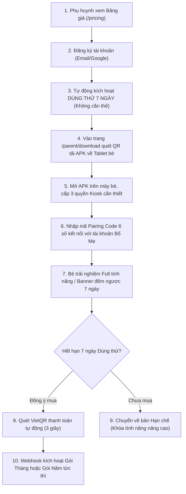
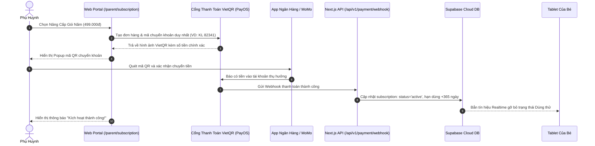

# 🚀 TÀI LIỆU THIẾT KẾ KIẾN TRÚC SAAS: ĐĂNG KÝ, DÙNG THỬ, BẢNG GIÁ & PHÂN PHỐI APK

> **Tên tài liệu:** Thiết Kế Kiến Trúc Hệ Thống SaaS KidsLauncher Kit  
> **Ngày tạo:** 06-09-2026  
> **Tác giả / Tư vấn:** Đội ngũ Kỹ thuật & Kiến trúc Giải pháp KidsLauncher  
> **Phiên bản:** 1.0.0  
> **Nền tảng mục tiêu:** Next.js Web Portal & Supabase Cloud (PostgreSQL, Storage, Auth, Realtime)  

---

## 📑 MỤC LỤC
1. [Tầm Nhìn & Mô Hình Kinh Doanh SaaS](#1-tầm-nhìn--mô-hình-kinh-doanh-saas)
2. [Hành Trình Người Dùng (End-to-End User Journey)](#2-hành-trình-người-dùng-end-to-end-user-journey)
3. [Chính Sách Dùng Thử & Chiến Lược Đóng Gói Bảng Giá](#3-chính-sách-dùng-thử--chiến-lược-đóng-gói-bảng-giá)
4. [Quy Trình Phân Phối APK & Ghép Nối Máy Trẻ (Pairing Engine)](#4-quy-trình-phân-phối-apk--ghép-nối-máy-trẻ-pairing-engine)
5. [Cơ Chế Thanh Toán Tự Động (VietQR / PayOS Webhook)](#5-cơ-chế-thanh-toán-tự-động-vietqr--payos-webhook)
6. [Thiết Kế Màn Hình & Module Mới Trên Web Portal](#6-thiết-kế-màn-hình--module-mới-trên-web-portal)
7. [Thiết Kế Cơ Sở Dữ Liệu SaaS Trên Supabase (Database Schema)](#7-thiết-kế-cơ-sở-dữ-liệu-saas-trên-supabase-database-schema)
8. [Lộ Trình Triển Khai Thực Hiện (Phased Roadmap)](#8-lộ-trình-triển-khai-thực-hiện-phased-roadmap)

---

## 🎯 1. TẦM NHÌN & MÔ HÌNH KINH DOANH SAAS

Chuyển đổi **KidsLauncher Kit** từ một ứng dụng chạy cục bộ trên Android (Single Device) thành một **Nền tảng Đám mây Quản lý Thiết bị Trẻ em & Giáo dục Song ngữ Đa Nền tảng (Cross-platform EdTech & Parental Control SaaS)** theo mô hình trả phí định kỳ (Subscription-based).

### Giá trị cốt lõi mang lại cho Phụ huynh:
* **Môi trường số an toàn tuyệt đối**: Khóa Kiosk ngăn trẻ thoát ra ngoài, cấm ứng dụng độc hại, lọc kênh YouTube Kids an toàn.
* **Vừa học vừa chơi**: Tích hợp 10 Mini Games giáo dục song ngữ và ngân hàng 10,000+ đề toán tự động sinh theo khối lớp.
* **Điều khiển từ xa dễ dàng**: Quản lý giờ chơi, giờ ngủ, khóa máy khẩn cấp tức thì trên Web Portal từ điện thoại của cha mẹ.

---

## 🧭 2. HÀNH TRÌNH NGƯỜI DÙNG (END-TO-END USER JOURNEY)



---

## 💰 3. CHÍNH SÁCH DÙNG THỬ & CHIẾN LƯỢC ĐÓNG GÓI BẢNG GIÁ

### 3.1. Chính Sách Dùng Thử (Free Trial Policy)
* **Thời gian dùng thử:** **7 ngày** (chu kỳ vàng đủ để trẻ yêu thích game toán và phụ huynh nhận thấy sự yên tâm).
* **Tiêu chí trải nghiệm:**
  * **Không rào cản (Zero Friction):** Đăng ký tài khoản xong là được dùng ngay, **không yêu cầu nhập thẻ tín dụng hay chuyển khoản trước**.
  * **Mở khóa 100% tính năng:** Mở trọn vẹn 10 Mini Games, ngân hàng đề toán, duyệt video YouTube Kids, khóa máy từ xa và đặt giờ đi ngủ.
  * **Giới hạn quy mô:** Tối đa **1 thiết bị** cho mỗi tài khoản trong giai đoạn dùng thử.
  * **Thông báo thân thiện:** Thanh đếm ngược nhẹ nhàng trên Web Portal *(VD: "Bạn còn 4 ngày dùng thử Pro")* và lời chào ngắn trên máy bé *(không làm gián đoạn việc học)*.

---

### 3.2. Bảng Giá Gói Dịch Vụ (SaaS Pricing Plans)

*(Đã tinh gọn theo định hướng tập trung vào 2 gói cốt lõi: Gói Tháng và Gói Năm)*

| Tiêu chí | 🆓 Dùng Thử (Free Trial) | 🌟 Gói Tháng (Monthly Standard) | 💎 Gói Năm (Yearly Pro - Tiết kiệm 40%) |
| :--- | :---: | :---: | :---: |
| **Giá niêm yết** | **0 VNĐ / 7 ngày** | **69.000 VNĐ / tháng** | **499.000 VNĐ / năm** *(~41.500đ/tháng)* |
| **Số lượng máy cho bé** | 1 máy | **2 máy** | **3 máy trong gia đình** |
| **Khóa Kiosk & Cấm thoát** | ✅ Đầy đủ | ✅ Đầy đủ | ✅ Đầy đủ |
| **10 Mini Games Song Ngữ** | ✅ Đầy đủ | ✅ Đầy đủ | ✅ Tự động cập nhật màn chơi mới |
| **Ngân hàng đề toán Cloud** | ✅ Đầy đủ | ✅ Đầy đủ | ✅ Sinh đề mới không giới hạn |
| **Lọc YouTube Kids an toàn** | ✅ Đầy đủ | ✅ Đầy đủ | ✅ Tự do thêm kênh whitelist |
| **Khóa máy từ xa & Giờ ngủ** | ✅ Đầy đủ | ✅ Đầy đủ | ✅ Đầy đủ |
| **Báo cáo Screen Time** | 7 ngày gần nhất | 30 ngày gần nhất | Toàn bộ lịch sử sử dụng |
| **Hỗ trợ kỹ thuật** | Cộng đồng / FAQ | Email / Chat hỗ trợ | Hỗ trợ Zalo VIP 1-1 |

---

## 📱 4. QUY TRÌNH PHÂN PHỐI APK & GHÉP NỐI MÁY TRẺ (PAIRING ENGINE)

### 4.1. Cách Phụ Huynh Tải & Cài Đặt APK
1. **Truy cập trang tải ứng dụng (`/parent/download`):**
   * Phụ huynh mở điện thoại hoặc máy tính bảng của bé quét mã **QR Code tải trực tiếp file APK** lưu trên Supabase Storage / CDN.
   * Hoặc truy cập đường dẫn rút gọn trên trình duyệt Chrome máy tính bảng: `https://kidslauncher.vn/tai-ve`.
2. **Hướng dẫn Onboarding 3 bước cấp quyền Kiosk (có ảnh minh họa):**
   * **Bước 1: Cài đặt file APK** -> Bấm "Cho phép cài đặt ứng dụng từ nguồn này".
   * **Bước 2: Chọn Home mặc định** -> Thiết lập KidsLauncher làm Trình khởi chạy chính (Default Home App) để bé không thể bấm phím Home thoát ra.
   * **Bước 3: Cấp quyền bảo vệ** -> Bật dịch vụ Hỗ trợ tiếp cận (Accessibility Service) và Quyền truy cập dữ liệu sử dụng (Usage Access) để kích hoạt tính năng khóa ứng dụng ngoài danh mục.

### 4.2. Cơ Chế Ghép Nối Thiết Bị (Pairing Mechanism)
* **Khởi chạy lần đầu:** App trên máy tính bảng hiển thị màn hình kích hoạt với **Mã ghép nối 6 chữ số** (VD: `739-182`) và 1 mã QR.
* **Ghép nối từ Bố Mẹ:** Phụ huynh truy cập Web Portal -> chọn mục **"Thêm thiết bị cho con"** -> Nhập 6 số hoặc quét camera.
* **Kích hoạt Realtime:** API xác thực và liên kết `device_id` với `user_id` của phụ huynh. Máy tính bảng bé nhận tín hiệu Realtime qua Supabase Websocket và chuyển thẳng vào màn hình học tập trong 1 giây.

---

## 💳 5. CƠ CHẾ THANH TOÁN TỰ ĐỘNG (VIETQR / PAYOS WEBHOOK)

Nhằm tối ưu hóa tỷ lệ chuyển đổi mà không cần nhân sự trực soát sao kê ngân hàng:



---

## 🏛️ 6. THIẾT KẾ MÀN HÌNH & MODULE MỚI TRÊN WEB PORTAL

### 6.1. Phân hệ Phụ huynh (Parent Portal)
1. **`/pricing` (Trang Bảng Giá & Giới Thiệu):**
   * So sánh trực quan Gói Tháng và Gói Năm.
   * Nút hành động nổi bật: **"Bắt Đầu Dùng Thử 7 Ngày Miễn Phí"**.
2. **`/auth/register` & `/auth/login`:**
   * Đăng ký/đăng nhập nhanh bằng Email hoặc Google OAuth.
   * Sau khi tạo tài khoản, hệ thống tự động gán gói `trial_7d` ngay lập tức.
3. **`/parent/download` (Trung Tâm Tải APK & Ghép Nối):**
   * Hiển thị mã QR tải file APK v1.x mới nhất.
   * Hướng dẫn trực quan 3 bước cấp quyền trên máy tính bảng bé.
4. **`/parent/subscription` (Quản Lý Gói Cước):**
   * Thông báo thời hạn sử dụng còn lại (đếm ngược ngày).
   * Nút nâng cấp gói mở Popup quét mã VietQR tự động.
   * Bảng lịch sử các lần gia hạn và hóa đơn điện tử.

### 6.2. Phân hệ Quản trị (Admin Studio)
1. **Nâng cấp Dashboard Quản trị (`/admin/dashboard`):**
   * Thêm các thẻ chỉ số kinh doanh:
     * **MRR (Doanh thu hàng tháng):** Tổng doanh thu định kỳ từ thuê bao.
     * **Người dùng dùng thử (Trial Users):** Số phụ huynh mới đăng ký trong tuần.
     * **Thuê bao trả phí (Active Subscriptions):** Số tài khoản đang hoạt động.
     * **Tỷ lệ chuyển đổi (Conversion Rate):** % khách từ dùng thử chuyển sang trả phí.
2. **Quản lý Khách hàng (`/admin/customers`):**
   * Danh sách phụ huynh, số điện thoại, số lượng tablet đã ghép nối, trạng thái gói cước.
   * Thao tác: Kích hoạt VIP thủ công, cộng thêm ngày dùng thử khi cần hỗ trợ khách hàng.
3. **Quản lý Phát hành APK (`/admin/apk-releases`):**
   * Tải lên bản build APK mới, đặt số phiên bản (Version Name, Version Code).
   * Viết nhật ký thay đổi (Changelog / Release Notes).
   * Cài đặt cờ ép buộc cập nhật (`is_force_update`) từ xa.

---

## 🗄️ 7. THIẾT KẾ CƠ SỞ DỮ LIỆU SAAS TRÊN SUPABASE (DATABASE SCHEMA)

Cấu trúc cơ sở dữ liệu được thiết kế tối ưu, liên kết chặt chẽ với hệ thống Auth và Thiết bị:

```sql
-- ==============================================================================
-- 1. BẢNG DANH MỤC GÓI CƯỚC (subscription_plans)
-- ==============================================================================
CREATE TABLE IF NOT EXISTS public.subscription_plans (
    id VARCHAR(50) PRIMARY KEY,          -- 'trial_7d', 'monthly_standard', 'yearly_pro'
    name VARCHAR(100) NOT NULL,          -- 'Dùng Thử 7 Ngày', 'Gói Tháng Chuẩn', 'Gói Năm Tiết Kiệm'
    price INT NOT NULL DEFAULT 0,        -- 0, 69000, 499000 (VNĐ)
    billing_cycle VARCHAR(20) NOT NULL,  -- 'trial', 'monthly', 'yearly'
    duration_days INT NOT NULL,          -- 7, 30, 365
    max_devices INT DEFAULT 1,           -- 1, 2, 3
    features JSONB DEFAULT '[]'::jsonb,  -- Danh sách các tính năng được mở khóa
    is_active BOOLEAN DEFAULT TRUE,
    created_at TIMESTAMPTZ DEFAULT NOW()
);

-- Nạp sẵn 3 gói cốt lõi
INSERT INTO public.subscription_plans (id, name, price, billing_cycle, duration_days, max_devices)
VALUES 
    ('trial_7d', 'Dùng Thử Miễn Phí', 0, 'trial', 7, 1),
    ('monthly_standard', 'Gói Tháng Chuẩn', 69000, 'monthly', 30, 2),
    ('yearly_pro', 'Gói Năm Tiết Kiệm', 499000, 'yearly', 365, 3)
ON CONFLICT (id) DO NOTHING;

-- ==============================================================================
-- 2. BẢNG QUẢN LÝ THUÊ BAO CỦA PHỤ HUYNH (user_subscriptions)
-- ==============================================================================
CREATE TABLE IF NOT EXISTS public.user_subscriptions (
    id UUID PRIMARY KEY DEFAULT gen_random_uuid(),
    user_id UUID REFERENCES auth.users(id) ON DELETE CASCADE UNIQUE,
    plan_id VARCHAR(50) REFERENCES public.subscription_plans(id) DEFAULT 'trial_7d',
    status VARCHAR(20) DEFAULT 'trialing' CHECK (status IN ('trialing', 'active', 'past_due', 'expired')),
    trial_start_at TIMESTAMPTZ DEFAULT NOW(),
    trial_end_at TIMESTAMPTZ DEFAULT (NOW() + INTERVAL '7 days'),
    current_period_start TIMESTAMPTZ DEFAULT NOW(),
    current_period_end TIMESTAMPTZ DEFAULT (NOW() + INTERVAL '7 days'),
    created_at TIMESTAMPTZ DEFAULT NOW(),
    updated_at TIMESTAMPTZ DEFAULT NOW()
);

-- ==============================================================================
-- 3. BẢNG QUẢN LÝ PHIÊN BẢN PHÁT HÀNH APK (apk_releases)
-- ==============================================================================
CREATE TABLE IF NOT EXISTS public.apk_releases (
    id UUID PRIMARY KEY DEFAULT gen_random_uuid(),
    version_name VARCHAR(20) NOT NULL,       -- '1.0.1'
    version_code INT NOT NULL UNIQUE,        -- 101
    apk_url TEXT NOT NULL,                   -- Link download trực tiếp file .apk
    file_size_bytes BIGINT DEFAULT 0,
    release_notes TEXT,                      -- Các tính năng mới / sửa lỗi
    is_force_update BOOLEAN DEFAULT FALSE,   -- Bắt buộc máy tính bảng phải nâng cấp
    is_active BOOLEAN DEFAULT TRUE,
    download_count INT DEFAULT 0,
    created_at TIMESTAMPTZ DEFAULT NOW()
);

-- ==============================================================================
-- 4. BẢNG GIAO DỊCH THANH TOÁN TỰ ĐỘNG (payment_transactions)
-- ==============================================================================
CREATE TABLE IF NOT EXISTS public.payment_transactions (
    id UUID PRIMARY KEY DEFAULT gen_random_uuid(),
    user_id UUID REFERENCES auth.users(id) ON DELETE CASCADE,
    plan_id VARCHAR(50) REFERENCES public.subscription_plans(id),
    order_code BIGINT UNIQUE NOT NULL,       -- Mã đơn hàng PayOS / VietQR (Số nguyên ngẫu nhiên)
    amount INT NOT NULL,                     -- Số tiền thanh toán (VNĐ)
    payment_method VARCHAR(30) DEFAULT 'vietqr',
    status VARCHAR(20) DEFAULT 'pending' CHECK (status IN ('pending', 'paid', 'cancelled', 'failed')),
    paid_at TIMESTAMPTZ,
    raw_webhook_data JSONB,
    created_at TIMESTAMPTZ DEFAULT NOW()
);

-- ==============================================================================
-- 5. CẬP NHẬT LIÊN KẾT BẢNG THIẾT BỊ (devices) VỚI TÀI KHOẢN PHỤ HUYNH
-- ==============================================================================
ALTER TABLE public.devices 
ADD COLUMN IF NOT EXISTS parent_user_id UUID REFERENCES auth.users(id) ON DELETE SET NULL,
ADD COLUMN IF NOT EXISTS pairing_code VARCHAR(10);

CREATE INDEX IF NOT EXISTS idx_devices_parent_user_id ON public.devices(parent_user_id);
CREATE INDEX IF NOT EXISTS idx_devices_pairing_code ON public.devices(pairing_code);
```

---

## 🚀 8. LỘ TRÌNH TRIỂN KHAI THỰC HIỆN (PHASED ROADMAP)

### Giai đoạn 1: Onboarding & Dùng Thử Miễn Phí (1 - 2 tuần)
* Xây dựng trang Bảng giá công khai (`/pricing`).
* Tích hợp Supabase Auth: Form đăng ký tự động cấp 7 ngày dùng thử vào bảng `user_subscriptions`.
* Xây dựng trang Hướng dẫn tải APK kèm mã QR và hướng dẫn 3 bước (`/parent/download`).
* Hoàn thiện API ghép nối thiết bị qua mã 6 số (`/api/v1/device/pair`).

### Giai đoạn 2: Tự Động Hóa Thanh Toán VietQR (1 tuần)
* Đăng ký tài khoản cổng thanh toán PayOS (miễn phí, hỗ trợ toàn bộ ngân hàng Việt Nam).
* Xây dựng trang Quản lý gói cước (`/parent/subscription`) hiển thị Popup mã QR chuyển khoản.
* Viết Webhook endpoint `/api/v1/payment/webhook` tự động cộng ngày dùng và gửi tín hiệu Realtime xuống tablet.

### Giai đoạn 3: Tối Ưu Quản Trị Admin SaaS (1 tuần)
* Nâng cấp Dashboard `/admin/dashboard` hiển thị doanh thu MRR, số phụ huynh đang dùng thử.
* Trang quản lý phiên bản APK `/admin/apk-releases` để dễ dàng phát hành file cài đặt mới cho phụ huynh.
