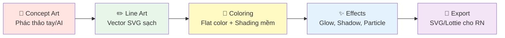

# 🌍🐾 TƯ VẤN 5 Ý TƯỞNG GAME GIÁO DỤC — KHÁM PHÁ THẾ GIỚI ĐỘNG VẬT & PHONG CẢNH

> **Dành cho:** Kids Launcher — React Native  
> **Đối tượng:** Trẻ 3 – 8 tuổi  
> **Triết lý:** Mỗi game là một cuộc phiêu lưu — bé không chỉ chơi mà còn **du hành**, **khám phá**, **yêu thương** và **học hỏi** qua từng màn chơi đẹp mắt.  
> *Ngày tạo: 09/09/2026*

---

## 📋 TỔNG QUAN 5 Ý TƯỞNG

| # | Tên Game | Chủ Đề | Số Màn | Nhân Vật Chính | Phong Cách Đồ Họa |
|:---:|:---|:---|:---:|:---|:---|
| 1 | 🦁 **Hành Trình Safari** | Thảo nguyên châu Phi | 8 màn | **Sư Tử Leo** — hoàng tử nhỏ | Warm Safari — Cam vàng hoàng hôn |
| 2 | 🐠 **Đại Dương Kỳ Diệu** | Biển sâu & rạn san hô | 10 màn | **Cá Hề Nemo** — nhà thám hiểm | Deep Ocean — Xanh sapphire & neon |
| 3 | 🐼 **Khu Rừng Mây** | Rừng nhiệt đới & rừng tre | 8 màn | **Gấu Trúc Bao** — nhà du hành | Misty Forest — Xanh lá sương mù |
| 4 | 🦅 **Bay Qua Lục Địa** | 7 châu lục trên thế giới | 7 màn | **Đại Bàng Vàng Ari** — phi công | Globe Trotting — Mỗi màn 1 bảng màu |
| 5 | 🦋 **Khu Vườn Bốn Mùa** | 4 mùa trong năm | 12 màn | **Bướm Hoa Luna** — nàng tiên | Seasonal Bloom — Pastel 4 mùa |

---

## 🎮 Ý TƯỞNG 1: HÀNH TRÌNH SAFARI — THẢO NGUYÊN CHÂU PHI

### 🎭 Nhân Vật Chính: **Sư Tử Leo** 🦁

| Thuộc tính | Chi tiết |
|:---|:---|
| **Tên** | Leo — Hoàng Tử Sư Tử Nhỏ |
| **Tính cách** | Dũng cảm nhưng hiền lành, tò mò và tốt bụng |
| **Ngoại hình** | Bờm vàng óng, mắt tròn to nâu ấm, luôn mỉm cười — phong cách **chibi tròn trịa** |
| **Trang phục** | Khăn quàng thám hiểm đỏ cam, ba lô nhỏ có ngôi sao |
| **Biểu cảm** | 6 trạng thái: Vui vẻ 😊, Ngạc nhiên 😮, Phấn khích 🤩, Lo lắng 😟, Tự hào 😎, Cảm động 🥺 |
| **Animation đặc biệt** | Lắc bờm khi vui, dậm chân khi phấn khích, nhảy xoay khi hoàn thành màn |

### 🎨 Phong Cách Đồ Họa

```
Tone tổng thể: WARM SAFARI
├── Bầu trời:     Gradient cam vàng hoàng hôn #FF8C42 → #FFD166
├── Cỏ thảo nguyên: Vàng rơm #E8D44D → Xanh oliu #9B8816
├── Cây Baobab:    Nâu ấm #A0522D, tán lá #556B2F
├── Mặt trời:     Vàng rực #FFB347 với hào quang mềm
├── Bóng đổ:      Tím hoàng hôn nhẹ #8B6FAE (opacity 20%)
└── Hiệu ứng:     Hạt bụi vàng bay nhẹ (particle dust)
```

### 📖 Kịch Bản 8 Màn Chơi

| Màn | Cảnh | Bé Học Gì | Tương Tác | Động Vật Gặp |
|:---:|:---|:---|:---|:---|
| 1 | 🌅 **Bình Minh Thảo Nguyên** | Nhận biết con vật hoang dã | Chạm vào con vật → Nghe tên + tiếng kêu | 🦒 Hươu Cao Cổ, 🦓 Ngựa Vằn |
| 2 | 💧 **Hồ Nước Ốc Đảo** | Động vật cần nước để sống | Kéo nước đến từng con vật đang khát | 🐘 Voi, 🦛 Hà Mã, 🐊 Cá Sấu |
| 3 | 🌿 **Rừng Cây Thưa** | Phân biệt thú ăn cỏ / ăn thịt | Kéo thả thức ăn đúng cho từng con | 🦁 Sư Tử, 🐃 Trâu Rừng, 🦌 Linh Dương |
| 4 | 🌙 **Đêm Trăng Safari** | Động vật hoạt động ban đêm | Rọi đèn pin tìm con vật ẩn nấp | 🦉 Cú, 🦇 Dơi, 🐆 Báo Hoa Mai |
| 5 | 🥚 **Tổ Chim Trên Cao** | Vòng đời: Trứng → Con non | Giúp chim mẹ ấp trứng (chạm giữ ấm) | 🦅 Đại Bàng, 🦜 Vẹt, 🐦 Chim Sẻ |
| 6 | 🏜️ **Sa Mạc Cát Vàng** | Thích nghi môi trường khắc nghiệt | Tìm bóng mát cho con vật tránh nóng | 🐪 Lạc Đà, 🦂 Bọ Cạp, 🦎 Thằn Lằn |
| 7 | 🌊 **Sông Ngầm Bí Ẩn** | Hệ sinh thái nước ngọt | Phân loại cá nước ngọt / nước mặn | 🐟 Cá Rô, 🦈 Cá Mập (so sánh), 🐢 Rùa |
| 8 | 🎆 **Lễ Hội Ánh Sáng** | Tổng kết — Tất cả con vật diễu hành | Chạm vào mỗi con → Nhớ lại tên + sự thật thú vị | Tất cả 20+ con vật đã gặp |

### 🌟 Cơ Chế Đặc Biệt

- **Sổ Tay Safari** 📓: Mỗi con vật được "chụp ảnh" vào sổ tay, có hình minh họa + fun fact
- **Chế độ AR giả lập**: Động vật "nhảy" ra từ khung cảnh khi bé chạm vào
- **Giọng kể chuyện**: Giọng đọc ấm áp dẫn chuyện như bác hướng dẫn viên safari

---

## 🎮 Ý TƯỞNG 2: ĐẠI DƯƠNG KỲ DIỆU — BIỂN SÂU & RẠN SAN HÔ

### 🎭 Nhân Vật Chính: **Cá Hề Nemo** 🐠

| Thuộc tính | Chi tiết |
|:---|:---|
| **Tên** | Nemo — Nhà Thám Hiểm Đại Dương Nhỏ |
| **Tính cách** | Nhỏ nhắn nhưng can đảm, thích khám phá và hay hát |
| **Ngoại hình** | Cam rực với 3 sọc trắng, mắt tròn xoe long lanh, vây nhỏ đáng yêu — phong cách **chibi mềm mại** |
| **Trang phục** | Kính lặn nhỏ trên đầu, ba lô vỏ sò xanh dương |
| **Biểu cảm** | 6 trạng thái: Phấn khích 🤩, Ngạc nhiên 😮, Vui vẻ 😊, Sợ hãi (đáng yêu) 😱, Cảm ơn 🥰, Ngủ 😴 |
| **Animation đặc biệt** | Bơi lượn vòng khi vui, phun bong bóng khi nói, nhảy múa khi hoàn thành màn |

### 🎨 Phong Cách Đồ Họa

```
Tone tổng thể: DEEP OCEAN FANTASY
├── Nước nông:     Gradient xanh ngọc #00CED1 → Xanh bạc hà #48D1CC
├── Nước sâu:      Xanh sapphire #1B3A5C → Xanh đen #0C1B33
├── San hô:        Neon rực rỡ — Hồng #FF69B4, Cam #FF6347, Tím #DA70D6
├── Ánh sáng:      Tia sáng xuyên nước (god rays) vàng nhạt #FFFFE0
├── Sinh vật phát sáng: Xanh neon #00FFFF, Xanh lá neon #39FF14
└── Hiệu ứng:     Bong bóng nước bay lên, hạt phát quang nhấp nháy
```

### 📖 Kịch Bản 10 Màn Chơi

| Màn | Cảnh | Bé Học Gì | Tương Tác | Sinh Vật Gặp |
|:---:|:---|:---|:---|:---|
| 1 | 🏖️ **Bờ Biển Xanh** | Sinh vật thủy triều, sóng biển | Nhặt vỏ sò, xem cua bò | 🦀 Cua, 🐚 Ốc Sên Biển, 🌊 Sao Biển |
| 2 | 🪸 **Rạn San Hô Cầu Vồng** | Hệ sinh thái san hô | Tô màu san hô, đếm cá | 🐠 Cá Hề, 🐡 Cá Nóc, 🦐 Tôm |
| 3 | 🐙 **Hang Bạch Tuộc** | Cách tự vệ của sinh vật biển | Giúp bạch tuộc đổi màu ngụy trang | 🐙 Bạch Tuộc, 🦑 Mực, 🐚 Ốc Anh Vũ |
| 4 | 🐬 **Vịnh Cá Heo** | Trí thông minh động vật | Chơi bóng cùng cá heo, nhảy vòng | 🐬 Cá Heo, 🐳 Cá Voi Nhỏ |
| 5 | 🧊 **Vùng Biển Băng** | Động vật vùng cực | Giúp hải cẩu trượt băng | 🐧 Cánh Cụt, 🦭 Hải Cẩu, 🐻‍❄️ Gấu Bắc Cực |
| 6 | 🌿 **Rừng Tảo Khổng Lồ** | Thực vật biển & chuỗi thức ăn | Cho rùa biển ăn tảo, tránh sứa | 🐢 Rùa Biển, 🪼 Sứa, 🐴 Cá Ngựa |
| 7 | ⚓ **Xác Tàu Cổ** | Khảo cổ dưới nước | Tìm kho báu ẩn, đối chiếu bản đồ | 🐡 Cá Nóc, 🦈 Cá Mập (hiền), 🐚 Trai Ngọc |
| 8 | 🌋 **Miệng Núi Lửa Ngầm** | Sinh vật ở nhiệt độ cực đoan | Quan sát sinh vật phát sáng | 🦐 Tôm Nhiệt Độ, 🐛 Giun Ống |
| 9 | 🌅 **Mặt Biển Hoàng Hôn** | Chuỗi thức ăn: Ai ăn ai? | Nối sinh vật theo chuỗi thức ăn | 🐟 Cá nhỏ → 🐬 Cá Heo → 🦈 Cá Mập |
| 10 | 🎪 **Lễ Hội Đại Dương** | Tổng kết — Diễu hành dưới biển | Trang trí sân khấu, mọi sinh vật biểu diễn | Tất cả 25+ sinh vật |

### 🌟 Cơ Chế Đặc Biệt

- **Bộ Sưu Tập Vỏ Sò** 🐚: Thu thập vỏ sò đặc biệt ở mỗi màn → Đổi lấy skin mới cho Nemo
- **Ống Nhòm Sâu** 🔭: Khi bé kéo màn hình xuống, camera "lặn sâu hơn" → Khám phá tầng nước mới
- **Hiệu ứng nước 3D**: Bong bóng theo ngón tay kéo, ánh sáng xuyên qua mặt nước lung linh

---

## 🎮 Ý TƯỞNG 3: KHU RỪNG MÂY — RỪNG NHIỆT ĐỚI & RỪNG TRE

### 🎭 Nhân Vật Chính: **Gấu Trúc Bao** 🐼

| Thuộc tính | Chi tiết |
|:---|:---|
| **Tên** | Bao Bao — Nhà Du Hành Rừng Mây |
| **Tính cách** | Ôn hòa, thích ăn tre, hay ngáp dễ thương, tốt bụng và chậm rãi |
| **Ngoại hình** | Đen trắng tương phản, bụng tròn vo, mắt viền đen to tròn, má hồng ửng — phong cách **kawaii 2D** |
| **Trang phục** | Mũ lá tre nhỏ, túi bao lá xanh đeo chéo |
| **Biểu cảm** | 7 trạng thái: Vui vẻ 😊, Ngáp 🥱, Ăn no 😋, Ngạc nhiên 😲, Cảm ơn 🤗, Buồn ngủ 😴, Siêu vui 🤩 |
| **Animation đặc biệt** | Lăn tròn khi di chuyển, nhai tre khi vui, ngồi thiền khi chờ, vẫy tay khi gặp bạn mới |

### 🎨 Phong Cách Đồ Họa

```
Tone tổng thể: MISTY FOREST — MÂY VÀ SƯƠNG
├── Sương mù:      Trắng xám nhẹ #F5F5F5 (opacity 40%) — Lớp overlay
├── Rừng tre:       Xanh lá nhạt #90EE90 → Xanh đậm #228B22
├── Thân tre:       Vàng kem #F5DEB3 → Xanh oliu #6B8E23
├── Hoa rừng:       Hồng đào #FFB7C5, Tím oải hương #E6E6FA, Vàng nghệ #FFD700
├── Suối nước:      Xanh ngọc trong #76D7C4 với bọt trắng
├── Núi xa:         Xanh tím mờ #9370DB → Xám xanh #708090
└── Hiệu ứng:      Lá rơi chậm, đom đóm nhấp nháy ban đêm, sương khói lững lờ
```

### 📖 Kịch Bản 8 Màn Chơi

| Màn | Cảnh | Bé Học Gì | Tương Tác | Động Vật Gặp |
|:---:|:---|:---|:---|:---|
| 1 | 🎋 **Rừng Tre Xanh** | Sinh cảnh gấu trúc, tre là gì | Cho Bao ăn tre, đếm cây tre | 🐼 Gấu Trúc con, 🐦 Chim Sẻ |
| 2 | 🌸 **Thung Lũng Hoa Đào** | Các loài hoa & côn trùng thụ phấn | Giúp ong lấy mật, kéo bướm đến hoa | 🦋 Bướm, 🐝 Ong, 🐞 Bọ Rùa |
| 3 | 🌧️ **Cơn Mưa Rừng** | Vòng tuần hoàn nước | Hứng nước mưa cho suối, xem cầu vồng | 🐸 Ếch, 🐌 Ốc Sên, 🦎 Tắc Kè Hoa |
| 4 | 🌳 **Tán Rừng Nhiệt Đới** | Động vật sống trên cây | Leo lên tán cây, tìm con vật ẩn | 🐒 Khỉ, 🦜 Vẹt Đỏ, 🦥 Con Lười |
| 5 | 🏔️ **Đỉnh Núi Sương Mù** | Động vật vùng núi cao | Giúp dê núi nhảy qua vách đá | 🐐 Dê Núi, 🦅 Chim Ưng, 🐈 Mèo Rừng |
| 6 | 🌙 **Rừng Đom Đóm** | Sinh vật phát sáng, ban đêm | Bắt đom đóm bỏ vào lồng (nhẹ nhàng) | 🪲 Đom Đóm, 🦉 Cú Mèo, 🦇 Dơi Quả |
| 7 | 🎣 **Suối Nước Trong** | Cá nước ngọt & đá cuội | Quan sát cá bơi, thả lá thuyền trên suối | 🐟 Cá Chép Koi, 🦆 Vịt Trời, 🐸 Ếch Cây |
| 8 | 🎊 **Lễ Hội Hoa Đăng** | Tổng kết — Bạn bè rừng mây | Thả đèn hoa đăng, tất cả bạn bè chào tạm biệt | Tất cả 20+ con vật |

### 🌟 Cơ Chế Đặc Biệt

- **Lá Bùa May Mắn** 🍀: Thu thập lá bùa ẩn ở mỗi màn → Mở khóa khu vực bí mật
- **Chế độ Thiền Rừng** 🧘: Cảnh rừng yên tĩnh + nhạc thiên nhiên → Giúp bé thư giãn trước khi ngủ
- **Album Động Vật Quý Hiếm**: Gấu trúc đỏ, báo tuyết — xuất hiện ngẫu nhiên, bé cần "chụp ảnh" nhanh

---

## 🎮 Ý TƯỞNG 4: BAY QUA LỤC ĐỊA — 7 CHÂU LỤC TRÊN THẾ GIỚI

### 🎭 Nhân Vật Chính: **Đại Bàng Vàng Ari** 🦅

| Thuộc tính | Chi tiết |
|:---|:---|
| **Tên** | Ari — Phi Công Đại Bàng Vàng |
| **Tính cách** | Mạnh mẽ, kiêu hãnh nhưng dịu dàng với bạn nhỏ, thích kể chuyện |
| **Ngoại hình** | Lông vàng óng ánh, cánh dang rộng hùng vĩ, mắt sắc bén nhưng nhân hậu — phong cách **noble chibi** |
| **Trang phục** | Kính phi công vintage, khăn đỏ bay phấp phới, huy hiệu ngôi sao trên ngực |
| **Biểu cảm** | 6 trạng thái: Tự hào 😎, Bay lượn 🤩, Đáp cánh 😊, Quan sát 🧐, Kể chuyện 📖, Chào tạm biệt 👋 |
| **Animation đặc biệt** | Dang cánh soaring khi bay, gập cánh khi đáp, xòe đuôi quạt khi kể chuyện |

### 🎨 Phong Cách Đồ Họa

```
Tone tổng thể: GLOBE TROTTING — Mỗi màn 1 palette riêng
├── Châu Phi:     Cam nóng #E67E22, Vàng hoàng hôn #F39C12
├── Châu Á:       Đỏ lễ hội #E74C3C, Vàng rồng #F1C40F  
├── Châu Âu:      Xanh dương hoàng gia #2980B9, Trắng kem #ECF0F1
├── Châu Mỹ:      Xanh lá Amazon #27AE60, Nâu Grand Canyon #A0522D
├── Châu Úc:      Cam outback #D35400, Xanh biển Great Barrier #1ABC9C
├── Bắc Cực:      Trắng tuyết #FAFAFA, Xanh băng #AED6F1
├── Nam Cực:       Xanh đậm #1B4F72, Trắng sáng #F8F9F9
└── Hiệu ứng:     Mây trôi parallax, gió thổi lá, mặt trời/trăng di chuyển theo giờ
```

### 📖 Kịch Bản 7 Màn Chơi (7 Châu Lục)

| Màn | Châu Lục | Phong Cảnh | Bé Học Gì | Động Vật Đại Diện |
|:---:|:---|:---|:---|:---|
| 1 | 🌍 **Châu Phi** | Thảo nguyên Serengeti, Kilimanjaro | Đại di cư, thú hoang dã | 🦁 Sư Tử, 🦒 Hươu, 🐘 Voi |
| 2 | 🌏 **Châu Á** | Vạn Lý Trường Thành, rừng tre | Rừng nhiệt đới, văn hóa Á Đông | 🐼 Gấu Trúc, 🐅 Hổ Bengal, 🐉 Rồng Komodo |
| 3 | 🌍 **Châu Âu** | Tháp Eiffel, Alps tuyết | Rừng lá rộng ôn đới | 🦌 Nai Sừng Tấm, 🐺 Sói, 🦢 Thiên Nga |
| 4 | 🌎 **Bắc Mỹ** | Grand Canyon, rừng Sequoia | Rừng lá kim, hẻm núi | 🐻 Gấu Nâu, 🦅 Đại Bàng Đầu Trắng, 🦫 Hải Ly |
| 5 | 🌎 **Nam Mỹ** | Amazon, Machu Picchu | Rừng mưa nhiệt đới lớn nhất | 🦜 Vẹt Macaw, 🐆 Báo Đốm, 🦥 Con Lười |
| 6 | 🌏 **Châu Úc** | Uluru, Great Barrier Reef | Thú có túi & rạn san hô | 🦘 Kangaroo, 🐨 Koala, 🐊 Cá Sấu |
| 7 | 🌍 **Vùng Cực** | Bắc Cực + Nam Cực | Thích nghi lạnh giá cực đoan | 🐧 Cánh Cụt, 🐻‍❄️ Gấu Trắng, 🦭 Hải Cẩu |

### 🌟 Cơ Chế Đặc Biệt

- **Bản Đồ Thế Giới Xoay** 🌐: Quả cầu 3D xoay được — bé chạm vào châu lục để bay tới
- **Hộ Chiếu Du Lịch** 🛂: Mỗi màn hoàn thành → Stamp visa mới vào hộ chiếu
- **Thẻ So Sánh Động Vật**: So sánh kích thước, tốc độ, tuổi thọ giữa các loài (dạng infographic dễ hiểu)
- **Mini-game Bay Lượn**: Nghiêng điện thoại → Ari bay theo, thu thập sao trên bầu trời

---

## 🎮 Ý TƯỞNG 5: KHU VƯỜN BỐN MÙA — XUÂN HẠ THU ĐÔNG

### 🎭 Nhân Vật Chính: **Bướm Hoa Luna** 🦋

| Thuộc tính | Chi tiết |
|:---|:---|
| **Tên** | Luna — Nàng Tiên Bướm Bốn Mùa |
| **Tính cách** | Duyên dáng, nhẹ nhàng, yêu thiên nhiên, hay hát và nhảy múa |
| **Ngoại hình** | Cánh bướm gradient cầu vồng (thay đổi theo mùa), thân nhỏ xinh, mắt to long lanh — phong cách **fairy chibi** |
| **Trang phục mùa** | Xuân: Vòng hoa đầu 🌸 / Hạ: Mũ hướng dương 🌻 / Thu: Khăn lá phong 🍂 / Đông: Mũ len tuyết ❄️ |
| **Biểu cảm** | 7 trạng thái: Bay nhẹ ✨, Hát vui 🎵, Ngắm hoa 🌸, Lạnh run 🥶, Nóng 🥵, Yêu thích 💕, Ngủ đông 😴 |
| **Animation đặc biệt** | Cánh vỗ nhẹ liên tục (idle), rắc phấn hoa khi bay, xoay tròn khi biến đổi mùa |

### 🎨 Phong Cách Đồ Họa

```
Tone tổng thể: SEASONAL BLOOM — 4 palette riêng biệt
├── 🌸 MÙA XUÂN:
│   ├── Nền:       Hồng phấn #FFE4E1 → Xanh non #E8F5E9
│   ├── Hoa:       Hồng anh đào #FFB7C5, Tím lavender #E6E6FA
│   └── Hiệu ứng: Cánh hoa bay rơi, bướm bay chập chờn
│
├── ☀️ MÙA HẠ:
│   ├── Nền:       Vàng rực #FFF9C4 → Cam nóng #FFE0B2
│   ├── Hoa:       Đỏ phượng #FF5252, Vàng hướng dương #FFD600
│   └── Hiệu ứng: Tia nắng nhấp nháy, ve kêu, giọt mồ hôi
│
├── 🍂 MÙA THU:
│   ├── Nền:       Cam ấm #FBE9E7 → Nâu vàng #EFEBE9
│   ├── Lá:        Đỏ lá phong #FF6F00, Vàng rụng #FFC107
│   └── Hiệu ứng: Lá phong rơi xoáy, gió nhẹ thổi lá
│
├── ❄️ MÙA ĐÔNG:
│   ├── Nền:       Xanh băng #E3F2FD → Trắng tuyết #FAFAFA
│   ├── Tuyết:     Trắng sáng #FFFFFF, Xanh nhạt #B3E5FC
│   └── Hiệu ứng: Tuyết rơi nhẹ, hơi thở trắng, mặt hồ đóng băng
```

### 📖 Kịch Bản 12 Màn Chơi (3 màn × 4 mùa)

#### 🌸 Chương 1: MÙA XUÂN — Thức Giấc

| Màn | Cảnh | Bé Học Gì | Tương Tác |
|:---:|:---|:---|:---|
| 1 | 🌱 **Hạt Giống Nảy Mầm** | Vòng đời thực vật | Gieo hạt → Tưới nước → Xem mầm mọc |
| 2 | 🐣 **Chim Non Ra Đời** | Trứng nở, chim mẹ nuôi con | Bón mồi cho chim non, nghe tiếng hót |
| 3 | 🦋 **Sâu Biến Thành Bướm** | Vòng đời bướm: Sâu → Kén → Bướm | Cho sâu ăn lá, chờ kén, mở cánh bướm |

#### ☀️ Chương 2: MÙA HẠ — Sôi Động

| Màn | Cảnh | Bé Học Gì | Tương Tác |
|:---:|:---|:---|:---|
| 4 | 🌻 **Cánh Đồng Hướng Dương** | Hoa hướng theo mặt trời | Kéo mặt trời → Hoa xoay theo |
| 5 | 🐝 **Tổ Ong Mật** | Ong thụ phấn, làm mật | Điều khiển ong bay đến từng bông hoa |
| 6 | 🦎 **Hồ Sen Mùa Hạ** | Sinh vật ao hồ, chuồn chuồn | Nhảy trên lá sen, bắt chuồn chuồn nhẹ nhàng |

#### 🍂 Chương 3: MÙA THU — Chuẩn Bị

| Màn | Cảnh | Bé Học Gì | Tương Tác |
|:---:|:---|:---|:---|
| 7 | 🍎 **Vườn Quả Chín** | Thu hoạch trái cây theo mùa | Hái táo, lê, nho bỏ vào giỏ |
| 8 | 🐿️ **Sóc Tích Trữ Hạt** | Thú chuẩn bị cho mùa đông | Giúp sóc tìm & cất hạt dẻ |
| 9 | 🍂 **Rừng Lá Phong Đỏ** | Lá đổi màu, chu kỳ thiên nhiên | Thổi lá bay, xem bức tranh thu thay đổi |

#### ❄️ Chương 4: MÙA ĐÔNG — Ngủ Đông

| Màn | Cảnh | Bé Học Gì | Tương Tác |
|:---:|:---|:---|:---|
| 10 | ⛄ **Bãi Tuyết Trắng** | Nước đóng băng thành tuyết | Nặn người tuyết, trượt tuyết mini |
| 11 | 🐻 **Gấu Ngủ Đông** | Động vật ngủ đông là gì | Đắp chăn cho gấu, nhím, ếch |
| 12 | 🎄 **Lễ Hội Mùa Đông** | Tổng kết: Vòng tuần hoàn 4 mùa | Trang trí cây thông, tất cả bạn bè xuất hiện |

### 🌟 Cơ Chế Đặc Biệt

- **Bánh Xe Mùa** ☀️🍂❄️🌸: Xoay bánh xe để chuyển mùa — thấy toàn bộ khu vườn biến đổi trước mắt
- **Nhật Ký Thiên Nhiên** 📔: Vẽ/dán sticker ghi lại sinh vật gặp ở mỗi mùa
- **Chế độ Đồng Hồ Thực**: Game tự chuyển mùa theo mùa thật bên ngoài (dựa theo ngày tháng)
- **Hát cùng Luna** 🎵: Mỗi mùa có 1 bài hát ngắn — bé chạm vào nốt nhạc để hát theo

---

## 🔧 SO SÁNH 5 Ý TƯỞNG — MA TRẬN LỰA CHỌN

| Tiêu chí | 🦁 Safari | 🐠 Đại Dương | 🐼 Rừng Mây | 🦅 Lục Địa | 🦋 Bốn Mùa |
|:---|:---:|:---:|:---:|:---:|:---:|
| **Độ phong phú cảnh** | ⭐⭐⭐⭐ | ⭐⭐⭐⭐⭐ | ⭐⭐⭐⭐ | ⭐⭐⭐⭐⭐ | ⭐⭐⭐⭐⭐ |
| **Đa dạng động vật** | 20+ loài | 25+ loài | 20+ loài | 30+ loài | 20+ loài |
| **Chiều sâu giáo dục** | ⭐⭐⭐⭐ | ⭐⭐⭐⭐⭐ | ⭐⭐⭐⭐ | ⭐⭐⭐⭐⭐ | ⭐⭐⭐⭐⭐ |
| **Hấp dẫn thị giác** | ⭐⭐⭐⭐⭐ | ⭐⭐⭐⭐⭐ | ⭐⭐⭐⭐ | ⭐⭐⭐⭐⭐ | ⭐⭐⭐⭐⭐ |
| **Độ khó triển khai** | Trung bình | Cao | Trung bình | Cao | Trung bình |
| **Replay value** | ⭐⭐⭐ | ⭐⭐⭐⭐ | ⭐⭐⭐⭐ | ⭐⭐⭐⭐ | ⭐⭐⭐⭐⭐ |
| **Phù hợp lứa tuổi** | 3 – 7 | 4 – 8 | 3 – 6 | 5 – 9 | 3 – 7 |

---

## 💡 ĐỀ XUẤT THỨ TỰ PHÁT TRIỂN

> [!TIP]
> **Gợi ý triển khai theo 3 phase:**

### Phase 1 — MVP (Ưu tiên cao nhất)
1. 🦋 **Khu Vườn Bốn Mùa** — Gần gũi nhất với đời sống, replay value cao nhất, pastel palette phù hợp kids launcher hiện tại

### Phase 2 — Mở Rộng
2. 🦁 **Hành Trình Safari** — Ấn tượng thị giác mạnh, kịch bản hấp dẫn
3. 🐠 **Đại Dương Kỳ Diệu** — Hiệu ứng nước & neon tạo trải nghiệm WOW

### Phase 3 — Hoàn Thiện
4. 🐼 **Khu Rừng Mây** — Phong cách zen, phù hợp làm chế độ thư giãn
5. 🦅 **Bay Qua Lục Địa** — Quy mô lớn nhất, cần nhiều asset nhất

---

## 🎨 NGUYÊN TẮC THIẾT KẾ NHÂN VẬT CHUNG

> [!IMPORTANT]
> **5 quy tắc vàng khi thiết kế nhân vật cho trẻ:**

| # | Quy Tắc | Chi Tiết |
|:---:|:---|:---|
| 1 | **Chibi Tròn Trịa** | Đầu to hơn thân, tỷ lệ 1:1 hoặc 1:1.5 — Trẻ thích hình tròn và dễ nhận diện |
| 2 | **Mắt To Long Lanh** | Mắt chiếm 30-40% khuôn mặt, có điểm sáng (highlight) — Tạo cảm giác sống động |
| 3 | **Bảng Màu Giới Hạn** | Mỗi nhân vật tối đa 4-5 màu chủ đạo — Không gây rối mắt |
| 4 | **Biểu Cảm Rõ Ràng** | Tối thiểu 6 biểu cảm — Trẻ cần nhìn thấy cảm xúc rõ ràng để phát triển EQ |
| 5 | **Phụ Kiện Nhận Diện** | Mỗi nhân vật có 1 phụ kiện đặc trưng (khăn, mũ, kính) — Tăng khả năng nhớ |

---

## 🖌️ GỢI Ý PIPELINE ĐỒ HỌA



| Công cụ | Dùng cho |
|:---|:---|
| **Figma / Adobe Illustrator** | Thiết kế nhân vật vector 2D |
| **Rive / Lottie** | Animation nhân vật tương tác |
| **AI Art (Midjourney/DALL-E)** | Concept art nhanh, mood board |
| **Spine 2D** | Skeletal animation phức tạp (nếu cần) |
| **React Native SVG** | Render vector trong app |

---

> 📌 *Tài liệu này là bản tư vấn ý tưởng. Sau khi chọn game để triển khai, cần tạo tài liệu đặc tả chi tiết (Game Design Document) riêng cho từng game.*
