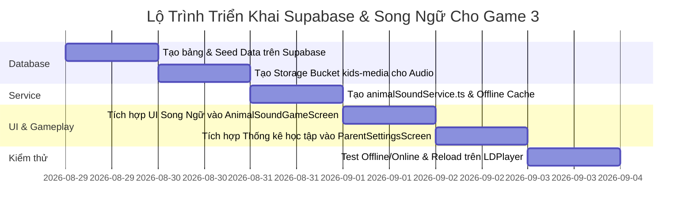

# 🐾 HƯỚNG DẪN NÂNG CẤP GAME 3: NGHE TIẾNG ĐOÁN CON VẬT VỚI SUPABASE & HỌC SONG NGỮ (VIỆT - ANH)

---

## 🎯 1. TỔNG QUAN & MỤC TIÊU NÂNG CẤP

Nâng cấp **Game 3: Nghe Tiếng Đoán Con Vật (Animal Sound Explorer)** từ trò chơi tĩnh (dữ liệu cục bộ) thành **Nền Tảng Giáo Dục Đa Phương Tiện Đám Mây (Cloud-Powered Bilingual Educational App)** với các mục tiêu trọng tâm:

1. **🌐 Tùy Chọn Học Song Ngữ (Tiếng Việt - Tiếng Anh - Song Ngữ Toàn Diện)**:
   - Bé và Phụ huynh có thể tự do chuyển đổi chế độ học ngôn ngữ theo nhu cầu.
   - Cung cấp tên gọi, phiên âm tiếng Anh chuẩn quốc tế (`IPA`), tiếng kêu phiên âm tiếng Việt và tiếng Anh (VD: Tiếng Việt: *Gâu gâu*, Tiếng Anh: *Woof woof*).
2. **☁️ Quản Trị Dữ Liệu Động Từ Supabase**:
   - Thêm mới, chỉnh sửa hàng trăm loài động vật từ xa qua Supabase Database & Storage mà **không cần build lại file APK**.
   - Lưu trữ file âm thanh thực tế (`.mp3`) của tiếng kêu và giọng đọc mẫu (Voiceover bản xứ).
3. **📊 Báo Cáo Tiến Độ & Phân Tích Khả Năng Nhớ Từ Vựng Cho Phụ Huynh**:
   - Ghi nhận lịch sử làm bài, theo dõi các từ vựng/con vật bé hay đoán đúng hoặc hay nhầm lẫn.
4. **📱 Kiến Trúc Offline-First**:
   - Dữ liệu được cache tự động trong máy (`MMKV`), đảm bảo **bé luôn chơi mượt mà ngay cả khi không có kết nối Internet**.

---

## ⚙️ 2. CHẾ ĐỘ CÀI ĐẶT NGÔN NGỮ (GAME SETTINGS)

Trong giao diện Game và Bảng Điều Khiển Phụ Huynh, bổ sung bộ chuyển đổi chế độ ngôn ngữ:

```
[ 🇻🇳 Tiếng Việt ]     [ 🇬🇧 Tiếng Anh ]     [ 🌐 Song Ngữ Toàn Diện ]
```

| Chế độ | Hiển thị tên con vật | Âm thanh & Mô tả | Mục đích giáo dục |
| :--- | :--- | :--- | :--- |
| **🇻🇳 Tiếng Việt** | "Chú Cún Con", "Bò Sữa", "Sư Tử" | Phát tiếng kêu + Tiếng sủa "Gâu gâu!" | Dành cho bé 2 - 4 tuổi phát triển ngôn ngữ mẹ đẻ, nhận biết môi trường xung quanh. |
| **🇬🇧 Tiếng Anh** | "Puppy / Dog", "Cow", "Lion" | Phát tiếng kêu + Tiếng kêu tiếng Anh "Woof woof!", "Moo moo!" | Dành cho bé 4 - 8 tuổi làm quen với từ vựng tiếng Anh giao tiếp tự nhiên. |
| **🌐 Song Ngữ** | "Chú Cún Con (Puppy)" kèm phiên âm `/ˈpʌp.i/` | Phát cả tiếng Việt + tiếng Anh + sự thật thú vị song ngữ | Phát triển song song tư duy ngôn ngữ kép, kích thích trí não. |

---

## 🗄️ 3. THIẾT KẾ CẤU TRÚC DATABASE SUPABASE (SQL SCHEMA)

### 3.1. Bảng Danh Mục Động Vật Song Ngữ (`kids_animals`)

```sql
-- Tạo bảng danh mục con vật song ngữ
CREATE TABLE IF NOT EXISTS kids_animals (
    id VARCHAR(50) PRIMARY KEY,                  -- Mã định danh: 'dog', 'cat', 'lion', 'dolphin'
    emoji VARCHAR(10) NOT NULL,                  -- Icon minh họa: '🐶', '🐱'
    category VARCHAR(30) NOT NULL DEFAULT 'farm',-- Phân loại: 'farm', 'wild', 'ocean', 'birds', 'insects'
    
    -- Dữ liệu Tiếng Việt
    name_vi VARCHAR(100) NOT NULL,               -- 'Chú Cún Con'
    sound_text_vi VARCHAR(100) NOT NULL,         -- 'Gâu gâu! Gâu gâu!'
    sound_desc_vi TEXT,                          -- 'Tiếng cún con sủa mừng khi chủ về'
    fun_fact_vi TEXT,                            -- 'Cún cưng có thính giác tốt gấp 4 lần con người!'
    
    -- Dữ liệu Tiếng Anh
    name_en VARCHAR(100) NOT NULL,               -- 'Puppy (Dog)'
    phonetic_en VARCHAR(100),                    -- '/ˈpʌp.i/' (Phiên âm quốc tế)
    sound_text_en VARCHAR(100) NOT NULL,         -- 'Woof woof! Bark bark!'
    sound_desc_en TEXT,                          -- 'Happy barking sound of a puppy'
    fun_fact_en TEXT,                            -- 'Dogs have an incredible sense of smell!'
    
    -- Media URLs (Lưu trên Supabase Storage Bucket: kids-media)
    sound_mp3_url TEXT,                          -- File âm thanh tiếng kêu thực tế
    voice_vi_url TEXT,                           -- Giọng đọc tên tiếng Việt
    voice_en_url TEXT,                           -- Giọng đọc tên tiếng Anh chuẩn bản xứ
    image_url TEXT,                              -- Ảnh minh họa động vật độ phân giải cao
    
    -- Cấu hình hiển thị
    difficulty INT DEFAULT 1,                    -- 1: Mầm non, 2: Tiểu học, 3: Nâng cao
    color_hex VARCHAR(20) DEFAULT '#FDE68A',     -- Màu chủ đạo của thẻ
    is_active BOOLEAN DEFAULT true,              -- Bật/tắt hiển thị
    display_order INT DEFAULT 0,                 -- Thứ tự ưu tiên
    created_at TIMESTAMP WITH TIME ZONE DEFAULT NOW(),
    updated_at TIMESTAMP WITH TIME ZONE DEFAULT NOW()
);
```

### 3.2. Bảng Lưu Lịch Sử & Tiến Độ Học Tập (`kids_animal_learning_logs`)

```sql
-- Tạo bảng lưu kết quả học tập của bé
CREATE TABLE IF NOT EXISTS kids_animal_learning_logs (
    id UUID PRIMARY KEY DEFAULT gen_random_uuid(),
    device_id VARCHAR(100) NOT NULL,             -- ID thiết bị
    profile_name VARCHAR(50) DEFAULT 'Bé Yêu',   -- Tên bé
    language_mode VARCHAR(20) NOT NULL,          -- 'vi', 'en', 'bilingual'
    game_mode VARCHAR(20) NOT NULL,              -- 'quiz' (Đố vui) hoặc 'explorer' (Khám phá)
    score INT NOT NULL,                          -- Điểm số đạt được (VD: 80)
    total_questions INT NOT NULL,                -- Tổng số câu hỏi (VD: 8)
    correct_animals JSONB DEFAULT '[]'::jsonb,   -- Danh sách ID con vật đoán đúng
    wrong_animals JSONB DEFAULT '[]'::jsonb,     -- Chi tiết câu đoán sai: [{"target": "lion", "chosen": "tiger"}]
    duration_seconds INT DEFAULT 0,              -- Thời gian hoàn thành (giây)
    created_at TIMESTAMP WITH TIME ZONE DEFAULT NOW()
);
```

---

## 📦 4. DỮ LIỆU MẪU BAN ĐẦU (SEED DATA - 12+ CON VẬT SONG NGỮ)

```sql
INSERT INTO kids_animals 
(id, emoji, category, name_vi, sound_text_vi, sound_desc_vi, fun_fact_vi, name_en, phonetic_en, sound_text_en, sound_desc_en, fun_fact_en, color_hex, difficulty)
VALUES
(
  'dog', '🐶', 'farm',
  'Chú Cún Con', 'Gâu gâu! Gâu gâu!', 'Tiếng cún con sủa vui mừng vẫy đuôi', 'Cún cưng luôn trung thành và rất thích được vuốt ve.',
  'Puppy / Dog', '/ˈpʌp.i/', 'Woof! Woof! Bark!', 'A cheerful dog barking happily', 'Dogs can understand up to 250 words and gestures!',
  '#FDE68A', 1
),
(
  'cat', '🐱', 'farm',
  'Mèo Con', 'Meo meo! Meo meo!', 'Tiếng mèo con kêu nũng nịu đòi ăn', 'Mèo có thể nhảy cao gấp 6 lần chiều dài cơ thể.',
  'Kitten / Cat', '/ˈkɪt.ən/', 'Meow! Meow! Purr!', 'A cute kitten meowing softly', 'Cats sleep for around 70% of their lives!',
  '#FED7AA', 1
),
(
  'rooster', '🐔', 'farm',
  'Gà Trống', 'Ò ó o o!', 'Tiếng gà trống gáy vang báo hiệu sáng sớm', 'Tiếng gáy của gà trống giúp đánh thức cả làng quê.',
  'Rooster', '/ˈruː.stɚ/', 'Cock-a-doodle-doo!', 'A proud rooster crowing in the morning', 'Roosters crow to announce their territory to other birds.',
  '#FECDD3', 1
),
(
  'duck', '🦆', 'farm',
  'Vịt Con', 'Cạp cạp! Cạp cạp!', 'Tiếng vịt con bơi lội dưới ao', 'Lông vịt không bao giờ bị ướt vì có lớp dầu chống nước.',
  'Duckling / Duck', '/ˈdʌk.lɪŋ/', 'Quack! Quack!', 'A duck quacking happily in the pond', 'Duck feathers are completely waterproof!',
  '#BAE6FD', 1
),
(
  'cow', '🐮', 'farm',
  'Bò Sữa', 'Ùm bòoo! Ùm bòoo!', 'Tiếng bò sữa trên đồng cỏ xanh', 'Bò sữa cho chúng ta nguồn sữa tươi giàu canxi mỗi ngày.',
  'Cow', '/kaʊ/', 'Moo! Mooo!', 'A gentle cow mooing on the green pasture', 'Cows have best friends and get stressed when separated!',
  '#E9D5FF', 1
),
(
  'lion', '🦁', 'wild',
  'Sư Tử', 'Gaooo! Gầm gừ!', 'Tiếng sư tử chúa sơn lâm gầm uy phong', 'Sư tử đực có chiếc bờm dũng mãnh bảo vệ đàn.',
  'Lion', '/ˈlaɪ.ən/', 'Roar! Roaaar!', 'A mighty lion roaring in the savanna', 'A lion’s roar can be heard from 8 kilometers away!',
  '#FEF08A', 2
),
(
  'elephant', '🐘', 'wild',
  'Chú Voi Khổng Lồ', 'Éc éc! Rống vang!', 'Tiếng voi huơ vòi gọi bạn', 'Chiếc vòi của voi có hơn 40.000 bó cơ bắp khéo léo.',
  'Elephant', '/ˈel.ə.fənt/', 'Pawoo! Trumpet!', 'An elephant trumpeting through its trunk', 'Elephants are the only animals that can’t jump!',
  '#CFFAFE', 2
),
(
  'dolphin', '🐬', 'ocean',
  'Cá Heo', 'Chít chít! Tách tách!', 'Tiếng cá heo phát sóng âm trò chuyện', 'Cá heo là một trong những loài vật thông minh nhất đại dương.',
  'Dolphin', '/ˈdɒl.fɪn/', 'Click! Whistle!', 'Dolphin clicking and whistling underwater', 'Dolphins sleep with one eye open to stay alert!',
  '#BAE6FD', 2
)
ON CONFLICT (id) DO UPDATE SET
  name_vi = EXCLUDED.name_vi,
  name_en = EXCLUDED.name_en,
  sound_text_vi = EXCLUDED.sound_text_vi,
  sound_text_en = EXCLUDED.sound_text_en,
  fun_fact_vi = EXCLUDED.fun_fact_vi,
  fun_fact_en = EXCLUDED.fun_fact_en;
```

---

## 🏗️ 5. KIẾN TRÚC CODE TRIỂN KHAI TRONG REACT NATIVE

### 5.1. File `example/src/services/animalSoundService.ts`
Chịu trách nhiệm:
1. Đọc/Ghi dữ liệu từ `storage` (MMKV) Offline Cache.
2. Gọi `supabaseClient.from('kids_animals')` để đồng bộ dữ liệu mới nhất từ Cloud khi có mạng.
3. Gửi nhật ký làm bài lên bảng `kids_animal_learning_logs`.
4. Cung cấp API chuyển đổi ngôn ngữ (`getLanguageMode()`, `setLanguageMode('vi' | 'en' | 'bilingual')`).

### 5.2. File `example/src/screens/AnimalSoundGameScreen.tsx`
Cập nhật UI:
- **Thanh chuyển đổi ngôn ngữ nhanh**: 3 nút `🇻🇳 VI`, `🇬🇧 EN`, `🌐 CẢ HAI` đặt trên Header.
- **Thẻ câu hỏi và đáp án động**:
  - Khi chọn `Tiếng Việt`: Thẻ hiển thị `"🐶 Chú Cún Con"`, bóng thoại phát `"Gâu gâu! Gâu gâu!"`.
  - Khi chọn `Tiếng Anh`: Thẻ hiển thị `"🐶 Puppy / Dog"`, bóng thoại phát `"Woof! Woof!"`.
  - Khi chọn `Song Ngữ`: Thẻ hiển thị `"Chú Cún Con (Puppy)"` kèm phiên âm `/ˈpʌp.i/`.
- **Hộp kiến thức bổ ích (Fun Fact Modal)**: Khi bé đoán đúng, hiển thị sự thật thú vị song ngữ để bé vừa chơi vừa học thêm kiến thức tự nhiên.

### 5.3. File `example/src/screens/ParentSettingsScreen.tsx`
Bổ sung tab **"Báo Cáo Học Tập Của Bé (Learning Dashboard)"**:
- Tỷ lệ trả lời đúng theo từng ngôn ngữ.
- Danh sách 5 con vật bé đã nhớ vanh vách.
- Danh sách con vật bé cần ôn tập thêm.

---

## 🚀 6. LỘ TRÌNH THỰC HIỆN



---

> 💡 **Tài liệu tham khảo liên quan:**
> - [KIDS_GAMES_GUIDE.md](file:///c:/react-native-launcher-kit/docs/KIDS_GAMES_GUIDE.md)
> - [supabaseClient.ts](file:///c:/react-native-launcher-kit/example/src/services/supabaseClient.ts)
> - [AnimalSoundGameScreen.tsx](file:///c:/react-native-launcher-kit/example/src/screens/AnimalSoundGameScreen.tsx)
