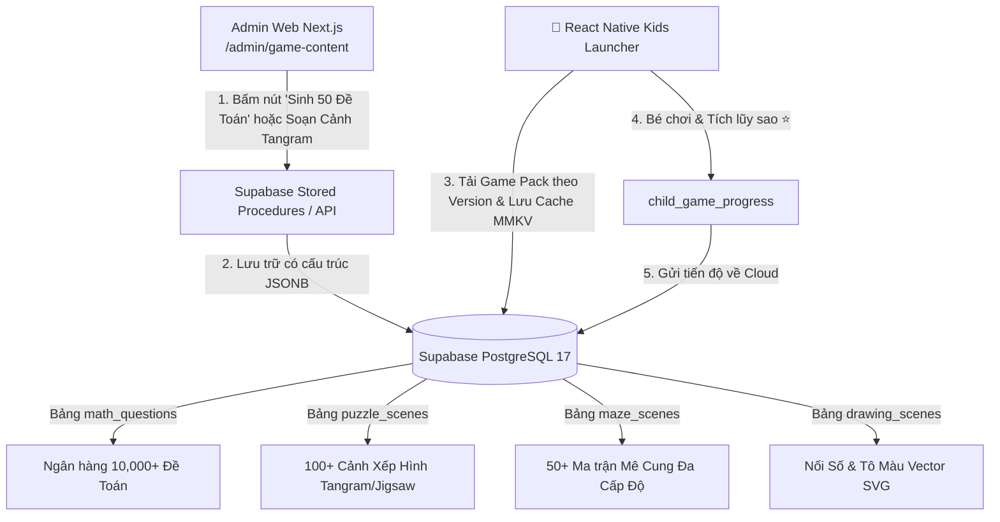
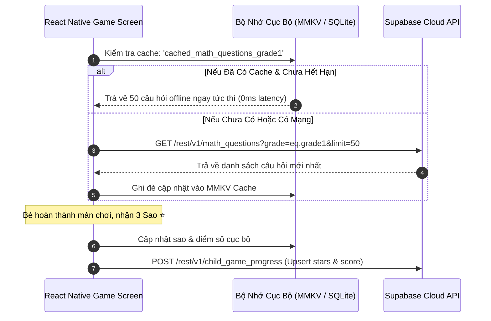

# 🎮 ĐẶC TẢ HỆ THỐNG GAME ĐỘNG & NGÂN HÀNG ĐỀ TOÁN TỰ ĐỘNG (SUPABASE + NEXT.JS)

> **Tài liệu thiết kế kiến trúc Game Động (Data-driven Scenes) & Động cơ Sinh Đề Toán Tự Động (Automated Math Quiz Engine) trên nền tảng Supabase Đám Mây & Next.js Admin CMS.**  
> *Phiên bản: 1.0.0*  
> *Áp dụng cho: 10 Mini Games trên React Native Kids Launcher.*

---

## 📑 MỤC LỤC

1. [Tại Sao Phải Chuyển Sang "Game Động" (Data-Driven Games)?](#1-tại-sao-phải-chuyển-sang-game-động-data-driven-games)
2. [Kiến Trúc Tổng Thể Lưu Trữ Cảnh Game Trên Supabase](#2-kiến-trúc-tổng-thể-lưu-trữ-cảnh-game-trên-supabase)
3. [Động Cơ Sinh Đề Toán Tự Động (Automated Math Generator)](#3-động-cơ-sinh-đề-toán-tự-động-automated-math-generator)
4. [Đặc Tả Cấu Trúc Dữ Liệu "Cảnh" (Scenes) Cho Từng Thể Loại Game](#4-đặc-tả-cấu-trúc-dữ-liệu-cảnh-scenes-cho-từng-thể-loại-game)
5. [Cơ Chế Đồng Bộ & Chơi Offline (Sync & Offline-First Caching)](#5-cơ-chế-đồng-bộ--chơi-offline-sync--offline-first-caching)
6. [Giao Diện Admin Quản Trị Cảnh Game & Sinh Đề (Next.js CMS Studio)](#6-giao-diện-admin-quản-trị-cảnh-game--sinh-đề-nextjs-cms-studio)

---

## 🎯 1. TẠI SAO PHẢI CHUYỂN SANG "GAME ĐỘNG" (DATA-DRIVEN GAMES)?

Trước đây, khi các câu hỏi toán, màn chơi Tangram hay Mê cung bị **hardcode trong mã nguồn React Native**:
* ❌ **Muốn thêm màn chơi mới**: Bắt buộc phải sửa code, build lại toàn bộ file APK và cập nhật app lên thiết bị của bé.
* ❌ **Ứng dụng bị nặng**: Hàng nghìn đề toán, ảnh, tọa độ làm dung lượng bundle phình to.
* ❌ **Trẻ nhanh chán**: Số lượng câu hỏi và màn chơi cố định, bé chơi vài lần sẽ thuộc lòng đáp án.

### ✅ Lợi ích vượt trội khi chuyển sang Game Động:
1. **Thêm màn chơi mới tức thì**: Admin chỉ cần nhập hoặc bấm nút "Sinh 100 đề toán" trên Web Next.js $\rightarrow$ Dữ liệu lưu vào Supabase $\rightarrow$ App của bé tự động có màn chơi mới mà **không cần cập nhật ứng dụng**.
2. **Cá nhân hóa theo độ tuổi**: Bé 3 tuổi nhận đề đếm hình con vật, bé 7 tuổi nhận đề toán có nhớ, bé 9 tuổi nhận đề bảng cửu chương.
3. **Tiết kiệm chi phí & Vận hành mượt mà**: Toàn bộ tài nguyên (cảnh mê cung, tọa độ ghép hình, âm thanh song ngữ) được quản lý tập trung trên Cloud.

---

## 🏛️ 2. KIẾN TRÚC TỔNG THỂ LƯU TRỮ CẢNH GAME TRÊN SUPABASE



---

## 🧮 3. ĐỘNG CƠ SINH ĐỀ TOÁN TỰ ĐỘNG (AUTOMATED MATH GENERATOR)

### 3.1. Ma Trận Đề Toán Theo Cấp Lớp (Grade Curriculum Matrix)

| Cấp Lớp | Thể Loại Phép Tính | Dải Số / Quy Luật | Dạng Hiển Thị (UI) |
| :--- | :--- | :--- | :--- |
| **Mầm Non (3-5t)** | `COUNTING` (Đếm hình) | Phạm vi $1 \to 10$ | Hiển thị mảng emoji con vật/hoa quả ngộ nghĩnh (🍎, 🐥, 🍓, 🚗) |
| **Lớp 1 (6-7t)** | `ADDITION`, `SUBTRACTION` | Phạm vi $10 \to 20$ (không nhớ & có nhớ) | Phép tính $5 + 3 = ?$, $12 - 4 = ?$ kèm giải thích bước tính |
| **Lớp 2 (7-8t)** | `MULTIPLICATION`, `COMPARISON` | Bảng nhân $2, 3, 4, 5$ & So sánh $(>, <, =)$ | $4 \times 6 = ?$, $15 + 8 \dots 25$ |
| **Lớp 3 (8-9t)** | `DIVISION`, `FILL_MISSING` | Bảng cửu chương $6 \to 9$ & Chia nhẩm | $56 : 8 = ?$, Điền số: $7 \times \underline{\quad} = 42$ |

### 3.2. Thuật Toán Sinh Đề Tự Động (Auto Generation Algorithm)

Hệ thống có thể chạy trực tiếp bằng **PostgreSQL Stored Procedure** (`generate_math_batch_questions`) hoặc qua **Next.js Server Action / Edge Function**:

1. **Bước 1 (Chọn Thể Loại & Biến Số)**:
   * Chọn ngẫu nhiên $a$ và $b$ trong dải giá trị của lớp học.
   * Tính đáp án đúng $C = a \text{ op } b$.
2. **Bước 2 (Tạo 3 Đáp Án Nhiễu Thông Minh - Smart Distractors)**:
   * Tránh tạo đáp án vô nghĩa. Tạo các đáp án gần đúng dễ gây nhầm lẫn: $C \pm 1$, $C \pm 2$, $C \pm 10$.
   * Đảm bảo 4 đáp án hoàn toàn phân biệt $\ge 0$.
3. **Bước 3 (Trộn & Gán Icon/Giải Thích)**:
   * Trộn ngẫu nhiên (Shuffle) 4 đáp án.
   * Tự động sinh câu giải thích mẫu: *"8 + 5 = 13 (Tách: 8 + 2 = 10, 10 + 3 = 13)"*.

```sql
-- Ví dụ gọi sinh ngay 50 câu hỏi phép nhân lớp 2:
SELECT generate_math_batch_questions(
    'a3333333-3333-3333-3333-333333333333'::UUID, 
    'grade2', 
    'MULTIPLICATION', 
    50
);
```

---

## 🎨 4. ĐẶC TẢ CẤU TRÚC DỮ LIỆU "CẢNH" (SCENES) CHO TỪNG THỂ LOẠI GAME

### 4.1. Cảnh Game Xếp Hình Tangram (`puzzle_scenes`)
Mỗi "cảnh" biểu diễn một bức tranh (Con mèo, Ngôi nhà, Máy bay) gồm nhiều mảnh ghép đa giác có tọa độ mục tiêu:

```json
{
  "id": "scene-tangram-cat-01",
  "title": "Chú Mèo Con Vui Vẻ",
  "category": "animals",
  "difficulty": 1,
  "board_width": 340,
  "board_height": 340,
  "board_bg_color": "#1E293B",
  "pieces": [
    {
      "id": "p1_head",
      "name": "Đầu Mèo",
      "emoji": "🐱",
      "color": "#F59E0B",
      "width": 80,
      "height": 80,
      "borderTopLeftRadius": 40,
      "borderTopRightRadius": 40,
      "targetX": 130,
      "targetY": 40
    },
    {
      "id": "p2_body",
      "name": "Thân Mèo",
      "emoji": "🔶",
      "color": "#3B82F6",
      "width": 120,
      "height": 100,
      "borderRadius": 16,
      "targetX": 110,
      "targetY": 130
    }
  ]
}
```

### 4.2. Cảnh Game Mê Cung (`maze_scenes`)
Biểu diễn ma trận tường và điểm xuất phát - kết thúc:

```json
{
  "id": "maze-jungle-01",
  "title": "Thỏ Tìm Cà Rốt - Màn 1",
  "grid_size": 4,
  "theme": "jungle",
  "start_avatar": "🐰",
  "target_avatar": "🥕",
  "start_pos": {"x": 0, "y": 0},
  "target_pos": {"x": 3, "y": 3},
  "walls_matrix": [
    {"x": 0, "y": 0, "right": false, "bottom": true},
    {"x": 1, "y": 0, "right": true, "bottom": false},
    {"x": 2, "y": 1, "right": false, "bottom": true}
  ]
}
```

### 4.3. Cảnh Game Nối Số & Tô Màu (`drawing_scenes`)
```json
{
  "id": "dots-star-01",
  "game_type": "connect_dots",
  "title": "Ngôi Sao May Mắn",
  "category": "shapes",
  "dots_coords": [
    {"order": 1, "x": 170, "y": 40, "label": "1"},
    {"order": 2, "x": 210, "y": 130, "label": "2"},
    {"order": 3, "x": 300, "y": 130, "label": "3"},
    {"order": 4, "x": 230, "y": 180, "label": "4"},
    {"order": 5, "x": 260, "y": 270, "label": "5"}
  ]
}
```

---

## ⚡ 5. CƠ CHẾ ĐỒNG BỘ & CHƠI OFFLINE (OFFLINE-FIRST SYNC)

Để đảm bảo bé có thể **chơi game mượt mà ngay cả khi không có WiFi/Internet**:



---

## 🖥️ 6. GIAO DIỆN ADMIN QUẢN TRỊ CẢNH GAME & SINH ĐỀ (NEXT.JS CMS STUDIO)

Trong phân hệ Next.js Admin (`/admin/game-content`), quản trị viên sẽ có các công cụ:

1. **Math Problem Generator Studio**:
   * Chọn khối lớp: *Mầm non / Lớp 1 / Lớp 2 / Lớp 3*.
   * Chọn dạng toán: *Đếm hình / Cộng trừ / Bảng nhân chia*.
   * Nhập số lượng cần sinh: `[ 50 ]` câu $\rightarrow$ Bấm **"Sinh Đề Hàng Loạt"** (Hệ thống tự động render xem trước và lưu vào DB).
   * Tích hợp AI Gemini (Tùy chọn): Sinh các bài toán có lời văn sinh động bằng tiếng Việt kèm emoji.
2. **Visual Tangram & Maze Level Editor**:
   * Kéo thả các khối hình trên canvas để tạo màn chơi Tangram/Jigsaw mới trực quan.
   * Bấm chuột lên lưới để dựng tường mê cung.
   * Bấm **"Lưu Cảnh Game"** $\rightarrow$ Hệ thống xuất JSON và lưu trực tiếp vào bảng `puzzle_scenes` / `maze_scenes`.
3. **Âm Thanh & Song Ngữ Studio (Audio & Vocab Manager)**:
   * Kéo thả file MP3 phát âm tiếng Việt / tiếng Anh.
   * Hệ thống tự động upload vào Supabase Storage Bucket `kids-media` và điền URL vào bảng từ vựng.
