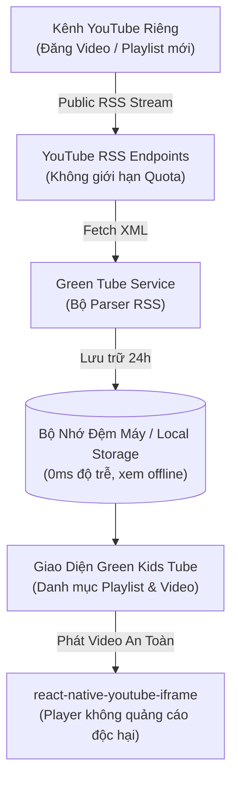

# HƯỚNG DẪN TÍCH HỢP KÊNH & PLAYLIST YOUTUBE RIÊNG VÀO GREEN TUBE

Tài liệu này tổng hợp toàn bộ giải pháp kỹ thuật, so sánh các phương án kết nối, và cung cấp kiến trúc tối ưu nhất để hiển thị **toàn bộ video và playlist của kênh YouTube riêng** trên ứng dụng **Green Tube**, loại bỏ hoàn toàn video ngoài lề và đảm bảo truy cập **không bị giới hạn hạn ngạch (quota)**.

---

## 1. Tổng Quan Mục Tiêu
* **Mục đích:** Biến ứng dụng Green Tube thành không gian video an toàn 100%, chỉ phát các nội dung thuộc sở hữu của kênh hoặc các playlist do chính bạn chỉ định.
* **Yêu cầu cốt lõi:**
  * Hiển thị danh mục Playlist riêng.
  * Hiển thị danh sách video thuộc từng playlist và video mới nhất của kênh.
  * Tự động đồng bộ khi bạn đăng tải video/playlist mới trên YouTube.
  * Truy cập ổn định, không giới hạn lượt xem, không phụ thuộc vào hạn ngạch ngặt nghèo của Google Cloud.

---

## 2. Bảng So Sánh Các Phương Án Kỹ Thuật

| Tiêu chí | Phương án 1: YouTube Data API v3 | Phương án 2: YouTube Public RSS Feed (Khuyên dùng 🌟) | Phương án 3: Cấu hình tĩnh (Static JSON) |
| :--- | :--- | :--- | :--- |
| **Giới hạn truy cập (Quota)** | ⚠️ **10.000 units/ngày** (Hết hạn mức sẽ bị khóa API đến ngày hôm sau) | ✅ **HOÀN TOÀN KHÔNG GIỚI HẠN** | ✅ **Không giới hạn** |
| **Đăng ký Google Cloud** | Bắt buộc tạo Project, kích hoạt API & tạo API Key | ❌ **Không cần tài khoản Google Cloud**, không cần API Key | ❌ Không cần |
| **Chi phí** | Miễn phí trong hạn mức; vượt quá phải trả phí | 🆓 **Miễn phí vĩnh viễn 100%** | 🆓 Miễn phí |
| **Tự động cập nhật** | Có (ngay lập tức) | Có (ngay lập tức khi đăng video mới) | ❌ Thủ công (phải sửa code mỗi khi thêm video) |
| **Dữ liệu hỗ trợ** | Video ID, Tiêu đề, Mô tả, Thumbnail, Thống kê view | Video ID, Tiêu đề, Mô tả, Thumbnail chất lượng cao, Ngày đăng | Tùy biến theo code |
| **Độ phức tạp tích hợp** | Trung bình (cần quản lý API Key, xử lý lỗi hạn mức) | Đơn giản (chỉ cần fetch URL XML và parse dữ liệu) | Rất đơn giản ban đầu, mất công bảo trì sau này |

---

## 3. Kiến Trúc Tối Ưu: "YouTube RSS Feed + Smart Local Cache"

Để ứng dụng đạt hiệu năng cao nhất, chạy mượt mà trên mọi thiết bị và không bị giới hạn, kiến trúc đề xuất kết hợp **YouTube RSS Feed** và **Bộ nhớ đệm cục bộ (Local Cache)**:



### 3.1. Cấu trúc URL RSS chính thức từ YouTube
YouTube cung cấp sẵn cổng xuất dữ liệu công khai theo chuẩn Atom XML:

* **Lấy video mới nhất của toàn bộ kênh:**
  ```
  https://www.youtube.com/feeds/videos.xml?channel_id={CHANNEL_ID}
  ```
  *(Ví dụ: `https://www.youtube.com/feeds/videos.xml?channel_id=UC_x5XG1OV2P6uZZ5FSM9Ttw`)*

* **Lấy toàn bộ video trong một Playlist cụ thể:**
  ```
  https://www.youtube.com/feeds/videos.xml?playlist_id={PLAYLIST_ID}
  ```
  *(Ví dụ: `https://www.youtube.com/feeds/videos.xml?playlist_id=PL1234567890ABCDEF`)*

### 3.2. Cấu trúc dữ liệu XML trả về
Mỗi thẻ `<entry>` trong kết quả trả về chứa đầy đủ thông tin để ứng dụng hiển thị:
* `<yt:videoId>`: Mã ID video để truyền vào player.
* `<title>`: Tiêu đề video.
* `<media:thumbnail url="...">`: Ảnh đại diện của video.
* `<published>`: Ngày xuất bản video.
* `<media:description>`: Mô tả nội dung video.

---

## 4. Hướng Dẫn Lấy Thông Tin Kênh & Playlist

### Bước 1: Lấy Channel ID (ID Kênh của bạn)
1. Đăng nhập vào [YouTube Studio](https://studio.youtube.com/).
2. Chọn menu **Cài đặt (Settings)** ở góc dưới bên trái -> chọn mục **Kênh (Channel)** -> chọn tab **Cài đặt nâng cao (Advanced Settings)**.
3. Cuộn xuống dưới cùng, chọn **Quản lý tài khoản YouTube (Manage YouTube account)**.
4. Bấm vào **Cài đặt nâng cao** ở menu bên trái.
5. Sao chép chuỗi **Mã nhận dạng kênh (Channel ID)**: Có dạng bắt đầu bằng chữ `UC...` dài 24 ký tự (ví dụ: `UC_x5XG1OV2P6uZZ5FSM9Ttw`).

### Bước 2: Lấy Playlist ID
1. Mở kênh của bạn trên trình duyệt, vào mục **Danh sách phát (Playlists)**.
2. Bấm vào xem một Playlist bất kỳ.
3. Nhìn lên thanh địa chỉ trình duyệt, sao chép phần mã phía sau `list=`:
   * URL mẫu: `https://www.youtube.com/playlist?list=PLr6-Sj5L-r-ABC12345XYZ`
   * Playlist ID chính là: `PLr6-Sj5L-r-ABC12345XYZ`.

---

## 5. Mã Nguồn Mẫu Triển Khai (TypeScript)

### 5.1. Bộ Service Đọc RSS Không Cần Thư Viện Nặng (`youtubeRssService.ts`)

```typescript
export interface RssVideoItem {
  videoId: string;
  title: string;
  thumbnail: string;
  published: string;
  description: string;
}

export const youtubeRssService = {
  /**
   * Lấy danh sách video từ Playlist ID không giới hạn quota
   */
  async fetchPlaylistVideos(playlistId: string): Promise<RssVideoItem[]> {
    const feedUrl = `https://www.youtube.com/feeds/videos.xml?playlist_id=${playlistId}`;
    return this.parseFeedUrl(feedUrl);
  },

  /**
   * Lấy danh sách video từ Channel ID
   */
  async fetchChannelVideos(channelId: string): Promise<RssVideoItem[]> {
    const feedUrl = `https://www.youtube.com/feeds/videos.xml?channel_id=${channelId}`;
    return this.parseFeedUrl(feedUrl);
  },

  /**
   * Trích xuất các thẻ XML sang mảng đối tượng video chuẩn
   */
  async parseFeedUrl(url: string): Promise<RssVideoItem[]> {
    try {
      const response = await fetch(url);
      const xmlText = await response.text();

      const items: RssVideoItem[] = [];
      const entryMatches = xmlText.match(/<entry>[\s\S]*?<\/entry>/g) || [];

      for (const entry of entryMatches) {
        const videoId = entry.match(/<yt:videoId>(.*?)<\/yt:videoId>/)?.[1] || '';
        const title = entry.match(/<title>(.*?)<\/title>/)?.[1] || '';
        const thumbnail =
          entry.match(/<media:thumbnail[^>]*url="(.*?)"/)?.[1] ||
          `https://img.youtube.com/vi/${videoId}/hqdefault.jpg`;
        const published = entry.match(/<published>(.*?)<\/published>/)?.[1] || '';
        const description = entry.match(/<media:description>([\s\S]*?)<\/media:description>/)?.[1] || '';

        if (videoId) {
          items.push({
            videoId,
            title: title.replace(/&amp;/g, '&').replace(/&lt;/g, '<').replace(/&gt;/g, '>'),
            thumbnail,
            published,
            description,
          });
        }
      }

      return items;
    } catch (error) {
      console.warn('Lỗi tải dữ liệu YouTube RSS Feed:', error);
      return [];
    }
  },
};
```

---

## 6. Các Điểm Cần Lưu Ý Khi Triển Khai
1. **Chế độ công khai của Playlist & Video:**
   * Các playlist và video phải ở chế độ **Công khai (Public)** hoặc **Không công khai (Unlisted)** để app có thể đọc được dữ liệu. Video ở chế độ Riêng tư (Private) sẽ không hiển thị trên RSS Feed.
2. **Quyền nhúng của Video (Allow Embedding):**
   * Trong YouTube Studio -> Chi tiết video -> Cài đặt nâng cao: Hãy đảm bảo tùy chọn **"Cho phép nhúng" (Allow embedding)** được bật để video có thể phát mượt mà trong trình phát nội bộ của Green Tube.
3. **Bộ nhớ đệm (Cache):**
   * Nên thiết lập thời gian làm mới bộ nhớ đệm (TTL) khoảng 30 phút - 2 giờ để bé mở app có video xem ngay lập tức mà không phải chờ tải lại mạng mỗi lần.
