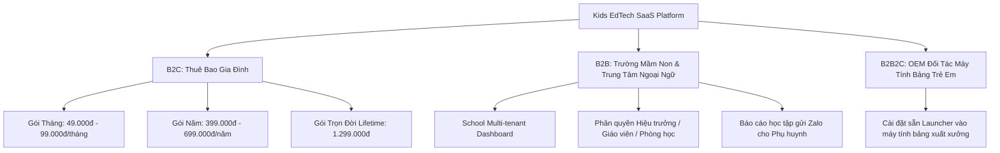
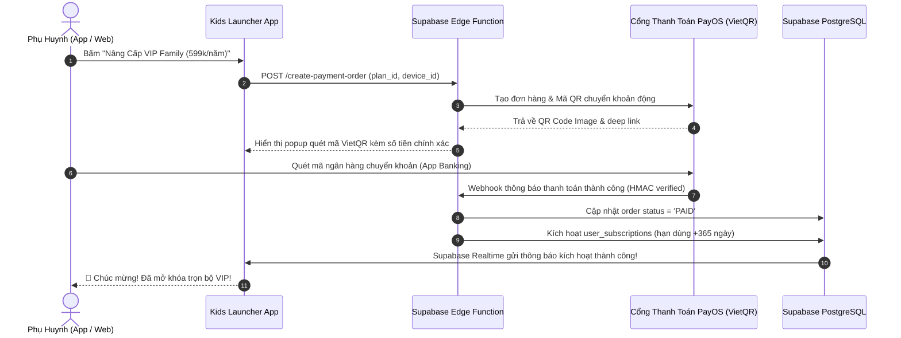
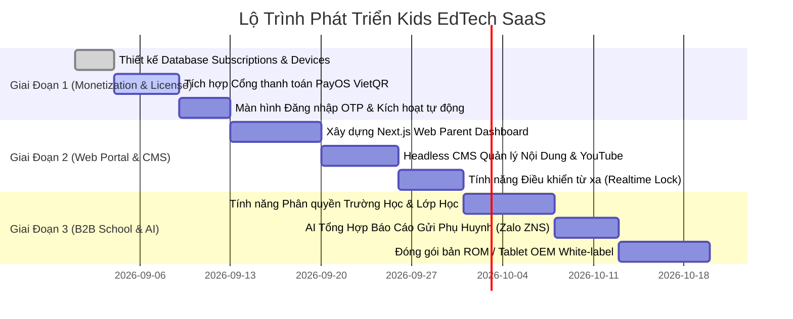

# 🚀 CHIẾN LƯỢC & KIẾN TRÚC XÂY DỰNG NỀN TẢNG SAAS: KIDS LAUNCHER & EDUCATIONAL GAMES

> **Tài liệu tư vấn kiến trúc kỹ thuật & mô hình kinh doanh SaaS (Software as a Service) cho hệ sinh thái Launcher Trẻ Em & 10 Mini Games Giáo Dục.**  
> *Phiên bản: 1.0.0*  
> *Hệ thống Backend: Supabase (PostgreSQL 17, Storage, Auth, Realtime, Edge Functions)*

---

## 📑 MỤC LỤC
1. [Tầm Nhìn & Mô Hình Kinh Doanh (Business Models)](#1-tầm-nhìn--mô-hình-kinh-doanh-business-models)
2. [Chiến Lược Đóng Gói Gói Cước (Pricing Tiers)](#2-chiến-lược-đóng-gói-gói-cước-pricing-tiers)
3. [Kiến Trúc Kỹ Thuật Tổng Thể (System Architecture)](#3-kiến-trúc-kỹ-thuật-tổng-thể-system-architecture)
4. [Thiết Kế Cấu Trúc Cơ Sở Dữ Liệu SaaS Trên Supabase](#4-thiết-kế-cấu-trúc-cơ-sở-dữ-liệu-saas-trên-supabase)
5. [Cơ Chế Thanh Toán Tự Động & Kích Hoạt License (Billing Engine)](#5-cơ-chế-thanh-toán-tự-động--kích-hoạt-license-billing-engine)
6. [Hệ Thống Điều Khiển Từ Xa (Remote Parent Control)](#6-hệ-thống-điều-khiển-từ-xa-remote-parent-control)
7. [Quản Trị Nội Dung Động (Headless CMS Studio)](#7-quản-trị-nội-dung-động-headless-cms-studio)
8. [Tích Hợp Trí Tuệ Nhân Tạo (AI Tutor & Insights)](#8-tích-hợp-trí-tuệ-nhân-tạo-ai-tutor--insights)
9. [Lộ Trình Triển Khai Chi Tiết (Phased Roadmap)](#9-lộ-trình-triển-khai-chi-tiết-phased-roadmap)

---

## 🎯 1. TẦM NHÌN & MÔ HÌNH KINH DOANH (BUSINESS MODELS)

Chuyển đổi từ ứng dụng Android cục bộ (Single Device) thành **Nền tảng Giáo dục & Quản lý Thiết bị Trẻ em Đa Nền tảng (Cross-platform EdTech & Parental Control SaaS)**.



### 1.1. B2C (Direct-to-Consumer: Phụ huynh & Gia đình)
- **Tập khách hàng**: Cha mẹ có con từ 2 đến 10 tuổi muốn môi trường số an toàn, không quảng cáo độc hại, kết hợp chơi và học tiếng Anh/Toán.
- **Giá trị cốt lõi**: Khóa màn hình an toàn (Kiosk Launcher), 10 Game giáo dục song ngữ đám mây, Video YouTube chọn lọc, Điều khiển từ xa qua điện thoại bố mẹ.

### 1.2. B2B (Trường Mầm Non, Tiểu Học, Trung Tâm Tiếng Anh)
- **Tập khách hàng**: Các trường song ngữ, mầm non tư thục cần trang bị máy tính bảng tương tác trong giờ học.
- **Giá trị cốt lõi**: Quản lý nhiều máy tính bảng cùng lúc (MDM nhẹ), khóa chế độ chỉ mở các bài học của trường, theo dõi kết quả từng học sinh theo lớp.

### 1.3. B2B2C (Đối tác Phần cứng / Tablet OEM)
- Bắt tay với các nhà phân phối máy tính bảng (Samsung, Masstel, Lenovo, máy tính bảng học tập) cài sẵn ROM/Launcher độc quyền.

---

## 💰 2. CHIẾN LƯỢC ĐÓNG GÓI GÓI CƯỚC (PRICING TIERS)

| Tính Năng | 🆓 Gói Miễn Phí (Free) | ⭐ Gói Gia Đình (Family Pro) | 🏫 Gói Trường Học (School B2B) |
| :--- | :---: | :---: | :---: |
| **Giá niêm yết** | **0 VNĐ** | **69.000đ / tháng** (hoặc 599.000đ / năm) | **30.000đ / máy / tháng** (Tối thiểu 20 máy) |
| **Số lượng thiết bị** | 1 máy | 3 - 5 máy trong gia đình | Không giới hạn (Theo hợp đồng) |
| **Kids Launcher An Toàn** | Khóa ứng dụng cơ bản | Full tính năng + Lịch khóa thông minh | Khóa theo thời khóa biểu của trường |
| **Số lượng Mini Game** | 3 Game cơ bản (cấp độ 1) | **Trọn bộ 10 Mini Games Song Ngữ** | Full 10 Game + Bài tập do trường giao |
| **Cập nhật dữ liệu Cloud** | Dữ liệu tĩnh cục bộ | Dữ liệu mới cập nhật hàng tuần | Tự tạo đề thi & bộ câu hỏi riêng |
| **Kids YouTube An Toàn** | 10 kênh cố định | Full kho 100+ kênh + Tự duyệt link | Danh sách video riêng của trường |
| **Điều khiển từ xa (Remote Control)** | ❌ Không | ✅ Web & App của Bố Mẹ | ✅ Web Quản Trị Trung Tâm của Trường |
| **Báo cáo Phân tích AI** | ❌ Không | ✅ Báo cáo tuần gửi qua Zalo/Email | ✅ Xuất Excel điểm & phân tích lớp |

---

## 🏛️ 3. KIẾN TRÚC KỸ THUẬT TỔNG THỂ (SYSTEM ARCHITECTURE)

```
┌────────────────────────────────────────────────────────────────────────────────────────┐
│                                 1. CLIENT APPLICATIONS                                 │
│  📱 Kids App (Android): React Native + Launcher Kit + MMKV Cache + Audio Engine        │
│  📱 Parent Mobile App (iOS/Android): Quản lý thời gian, khóa máy, xem tiến độ          │
│  💻 Parent & School Web Portal (Next.js / TailwindCSS): Bảng điều khiển từ xa          │
└───────────────────────────────────────────┬────────────────────────────────────────────┘
                                            │ (HTTPS / WSS Realtime)
┌───────────────────────────────────────────▼────────────────────────────────────────────┐
│                               2. CLOUD BACKEND (SUPABASE)                               │
│  ├── 🗄️ PostgreSQL 17 Database: Multi-tenancy, Subscriptions, Devices, Logs, Content   │
│  ├── ⚡ Supabase Edge Functions (Deno / TS): Webhook thanh toán, AI Content Generation │
│  ├── 🔄 Supabase Realtime Channels: Lệnh khóa/mở máy tức thì từ Web xuống Tablet       │
│  ├── 🔐 Supabase Auth: Quản lý đăng nhập Phụ huynh (OTP SMS, Google, Zalo, Apple)      │
│  └── 📦 Supabase Storage (Bucket kids-media): Âm thanh MP3, Ảnh Vector SVG, Video      │
└───────────────────────────────────────────┬────────────────────────────────────────────┘
                                            │
┌───────────────────────────────────────────▼────────────────────────────────────────────┐
│                             3. THIRD-PARTY INTEGRATIONS                                │
│  💳 Cổng Thanh Toán: PayOS (VietQR Pro) / MoMo / Stripe / Apple In-App Purchase        │
│  🤖 GenAI Engine: Google Gemini 1.5 Flash / OpenAI GPT-4o-mini (Sinh nội dung bài học) │
│  📲 Thông Báo & Tin Nhắn: Firebase Cloud Messaging (FCM) + Zalo ZNS / SendGrid Email    │
└────────────────────────────────────────────────────────────────────────────────────────┘
```

---

## 🗄️ 4. THIẾT KẾ CẤU TRÚC CƠ SỞ DỮ LIỆU SAAS TRÊN SUPABASE

### 4.1. Bảng Quản Lý Gói Thuê Bao (`saas_plans`)
```sql
CREATE TABLE IF NOT EXISTS public.saas_plans (
    id VARCHAR(50) PRIMARY KEY,                  -- 'free', 'family_monthly', 'family_yearly', 'family_lifetime', 'school_yearly'
    name VARCHAR(100) NOT NULL,                  -- 'Gói Gia Đình (1 Năm)'
    price_vnd INT NOT NULL DEFAULT 0,            -- 599000
    duration_days INT NOT NULL DEFAULT 30,       -- 365
    max_devices INT NOT NULL DEFAULT 3,          -- 3
    features JSONB DEFAULT '{}'::jsonb,          -- {"all_games": true, "ai_report": true, "remote_control": true}
    is_active BOOLEAN DEFAULT true,
    created_at TIMESTAMP WITH TIME ZONE DEFAULT NOW()
);
```

### 4.2. Bảng Thuê Bao Người Dùng (`user_subscriptions`)
```sql
CREATE TABLE IF NOT EXISTS public.user_subscriptions (
    id UUID PRIMARY KEY DEFAULT gen_random_uuid(),
    user_id UUID REFERENCES auth.users(id) ON DELETE CASCADE,
    plan_id VARCHAR(50) REFERENCES public.saas_plans(id),
    status VARCHAR(20) NOT NULL DEFAULT 'active', -- 'active', 'expired', 'cancelled'
    started_at TIMESTAMP WITH TIME ZONE DEFAULT NOW(),
    expires_at TIMESTAMP WITH TIME ZONE NOT NULL,
    auto_renew BOOLEAN DEFAULT false,
    created_at TIMESTAMP WITH TIME ZONE DEFAULT NOW()
);
```

### 4.3. Bảng Thiết Bị Đã Kích Hoạt (`user_devices`)
```sql
CREATE TABLE IF NOT EXISTS public.user_devices (
    id VARCHAR(100) PRIMARY KEY,                 -- Device ID (Android Hardware ID / UUID)
    user_id UUID REFERENCES auth.users(id) ON DELETE CASCADE,
    device_name VARCHAR(100) DEFAULT 'Máy Tính Bảng Của Bé',
    model_info VARCHAR(100),
    app_version VARCHAR(20),
    is_locked BOOLEAN DEFAULT false,             -- Trạng thái khóa từ xa
    daily_limit_minutes INT DEFAULT 60,          -- Hạn mức chơi mỗi ngày
    last_active_at TIMESTAMP WITH TIME ZONE DEFAULT NOW(),
    created_at TIMESTAMP WITH TIME ZONE DEFAULT NOW()
);
```

### 4.4. Bảng Lệnh Điều Khiển Từ Xa (`device_remote_commands`)
```sql
CREATE TABLE IF NOT EXISTS public.device_remote_commands (
    id UUID PRIMARY KEY DEFAULT gen_random_uuid(),
    device_id VARCHAR(100) REFERENCES public.user_devices(id) ON DELETE CASCADE,
    command_type VARCHAR(30) NOT NULL,          -- 'LOCK_NOW', 'UNLOCK_NOW', 'ADD_TIME_BONUS', 'UPDATE_SCHEDULE'
    payload JSONB DEFAULT '{}'::jsonb,          -- {"bonus_minutes": 15}
    is_executed BOOLEAN DEFAULT false,
    created_at TIMESTAMP WITH TIME ZONE DEFAULT NOW()
);
```

### 4.5. Bảng Lịch Sử Giao Dịch Thanh Toán (`payment_orders`)
```sql
CREATE TABLE IF NOT EXISTS public.payment_orders (
    order_code BIGINT PRIMARY KEY,              -- Mã đơn hàng PayOS / VietQR
    user_id UUID REFERENCES auth.users(id),
    plan_id VARCHAR(50) REFERENCES public.saas_plans(id),
    amount INT NOT NULL,
    payment_method VARCHAR(30) DEFAULT 'vietqr',-- 'vietqr', 'momo', 'stripe', 'in_app_purchase'
    status VARCHAR(20) DEFAULT 'PENDING',       -- 'PENDING', 'PAID', 'CANCELLED', 'FAILED'
    checkout_url TEXT,
    qr_code TEXT,
    paid_at TIMESTAMP WITH TIME ZONE,
    created_at TIMESTAMP WITH TIME ZONE DEFAULT NOW()
);
```

---

## 💳 5. CƠ CHẾ THANH TOÁN TỰ ĐỘNG & KÍCH HOẠT LICENSE

Quy trình thanh toán QR Code (PayOS / VietQR) tự động 100% không cần can thiệp thủ công:



---

## 📱 6. HỆ THỐNG ĐIỀU KHIỂN TỪ XA (REMOTE PARENT CONTROL)

Phụ huynh đi làm tại văn phòng có thể mở điện thoại hoặc trình duyệt web điều khiển máy tính bảng của con ở nhà:

1. **Khóa máy tức thì (Instant Lock)**:
   - Phụ huynh bấm *"Khóa Máy Ăn Cơm"* trên Web Dashboard.
   - Supabase Realtime Channel bắn sự kiện `LOCK_DEVICE` xuống Tablet.
   - Launcher hiển thị màn hình khóa toàn diện kèm thông điệp: *"Đã đến giờ ăn cơm! Bé hãy nghỉ ngơi cùng cả nhà nhé."*
2. **Thưởng thêm giờ (Time Bonus Reward)**:
   - Khi bé làm xong bài tập, bố mẹ bấm *"Thưởng 15 phút chơi"* $\rightarrow$ Ứng dụng tự động cộng thêm thời gian.
3. **Cập nhật thời khóa biểu (Schedule Sync)**:
   - Thay đổi khung giờ được phép sử dụng từ xa mà không cần cầm vào máy của bé.

---

## 🎨 7. QUẢN TRỊ NỘI DUNG ĐỘNG (HEADLESS CMS STUDIO)

Xây dựng Web Dashboard Quản trị (Next.js) giúp vận hành nội dung nhanh chóng:

* **Quản lý 10 Mini Game**:
  - Thêm con vật, từ vựng, hình khối, bảng màu, phép tính mới.
  - Tải lên file âm thanh MP3 và hình ảnh minh họa lên Supabase Storage.
* **Quản lý Video YouTube Kids**:
  - Dán đường link kênh YouTube hoặc Playlist $\rightarrow$ Hệ thống tự crawl tiêu đề, ảnh thumbnail và duyệt cho phép hiển thị trên máy của bé.
* **Quản lý Khách hàng & Doanh số**:
  - Thống kê doanh thu theo ngày/tháng, số lượng thiết bị hoạt động đồng thời (MAU/DAU).

---

## 🤖 8. TÍCH HỢP TRÍ TUỆ NHÂN TẠO (AI TUTOR & INSIGHTS)

Tận dụng LLM (Google Gemini API / OpenAI) để tạo điểm khác biệt vượt trội cho sản phẩm:

```
┌────────────────────────────────────────────────────────────────────────┐
│                        AI GENERATIVE USE CASES                         │
├────────────────────────────────────────────────────────────────────────┤
│ 1. Tự Động Sinh Nội Dung Bài Học (AI Content Generation):              │
│    • Prompt: "Tạo 10 câu đố song ngữ về loài vật dưới đại dương"       │
│    • Output: JSON nạp trực tiếp vào bảng kids_animals.                 │
│                                                                        │
│ 2. Trợ Lý AI Phân Tích Báo Cáo Học Tập (AI Progress Summary):          │
│    • Đọc dữ liệu từ kids_animal_learning_logs & math_quiz_logs.        │
│    • Sinh nhận xét gửi Zalo/Email cho bố mẹ:                           │
│      "Tuần này bé đã ghi nhớ 12 từ vựng động vật mới, phản xạ toán     │
│       cộng nhanh hơn 25%. Bé cần ôn tập thêm về màu sắc tiếng Anh."    │
│                                                                        │
│ 3. Giọng Đọc Bản Xứ Tự Nhiên (AI Text-to-Speech):                      │
│    • Sử dụng ElevenLabs / Google Cloud TTS phát âm chuẩn Anh - Mỹ.     │
└────────────────────────────────────────────────────────────────────────┘
```

---

## 🚀 9. LỘ TRÌNH TRIỂN KHAI CHI TIẾT (PHASED ROADMAP)



---

## 📌 TỔNG KẾT & BƯỚC ĐI TIẾP THEO

Việc xây dựng hệ thống **Kids Launcher & Educational Games** theo mô hình SaaS giải quyết trọn vẹn bài toán:
1. **Dòng tiền định kỳ (MRR/ARR)** từ các gói thuê bao gia đình và trường học.
2. **Khả năng mở rộng vô hạn** nhờ kiến trúc Supabase Cloud, không cần build lại app khi thêm nội dung mới.
3. **Giá trị gia tăng cao** nhờ kết hợp giữa **Bảo vệ an toàn trẻ em (Parental Control)** và **Giáo dục sớm thông minh (EdTech)**.
