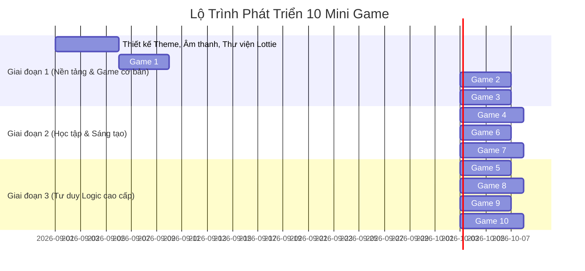

# 🎮 HƯỚNG DẪN & KẾ HOẠCH PHÁT TRIỂN 10 MINI GAME CHO BÉ (MẦM NON & TIỂU HỌC)

> **Tài liệu tư vấn thiết kế Game Giáo dục trên nền tảng React Native / Kids Launcher.**  
> *Phiên bản: 1.0.0*  
> *Mục tiêu: Xây dựng các trò chơi an toàn, không quảng cáo, tương tác nhẹ nhàng, kết hợp học tập và rèn luyện tư duy.*

---

## 📑 MỤC LỤC
1. [Nguyên Tắc Thiết Kế UX/UI Cho Trẻ Em](#1-nguyên-tắc-thiết-kế-uxui-cho-trẻ-em)
2. [Ngăn Xếp Công Nghệ Đề Xuất (Tech Stack)](#2-ngăn-xếp-công-nghệ-đề-xuất-tech-stack)
3. [Danh Sách 10 Mini Game Cần Xây Dựng](#3-danh-sách-10-mini-game-cần-xây-dựng)
   - [Nhóm 1: Dành cho Mầm Non (3 - 5 tuổi)](#nhóm-1-dành-cho-mầm-non-3---5-tuổi)
   - [Nhóm 2: Dành cho Tiểu Học (6 - 10 tuổi)](#nhóm-2-dành-cho-tiểu-học-6---10-tuổi)
4. [Lộ Trình Triển Khai (Roadmap)](#4-lộ-trình-triển-khai-roadmap)

---

## 1. NGUYÊN TẮC THIẾT KẾ UX/UI CHO TRẺ EM

| Tiêu chuẩn | Chi tiết triển khai |
| :--- | :--- |
| **Giao diện trực quan** | Hạn chế tối đa chữ đối với lứa tuổi mầm non. Sử dụng biểu tượng (Icon, Emoji), hình vẽ vector 2D bắt mắt. |
| **Vùng chạm lớn (Touch Target)** | Vùng bấm tối thiểu **`60x60 dp`** để các ngón tay nhỏ của bé chạm chính xác mà không bấm nhầm. |
| **Âm thanh & Giọng đọc (Audio-First)** | Có âm thanh vui nhộn cho mọi tương tác (*Ting ting, Pop, Tiếng vỗ tay, Tiếng động vật*) và giọng đọc tiếng Việt hỗ trợ hướng dẫn. |
| **Phản hồi tích cực (Positive Reinforcement)** | Khi làm đúng: Thưởng sao ⭐, hiệu ứng pháo hoa, vỗ tay. Khi làm sai: Không tạo âm thanh còi phạt chói tai, khích lệ *"Bé thử lại nhé!"*. |
| **An toàn tuyệt đối** | Không quảng cáo bên ngoài, khóa bàn phím thoát ra Launcher ngoài, giới hạn thời gian chơi game hàng ngày (Daily Timer). |

---

## 2. NGĂN XẾP CÔNG NGHỆ ĐỀ XUẤT (TECH STACK)

* **UI & Chuyển động (Animations)**: `react-native-reanimated`, `react-native-gesture-handler`.
* **Hiệu ứng Thưởng (VFX)**: `lottie-react-native` (Chạy các tệp JSON pháo hoa, cúp vàng, ngôi sao từ LottieFiles).
* **Âm thanh (Audio)**: `react-native-sound` hoặc `expo-av`.
* **Giọng đọc tiếng Việt (TTS)**: `react-native-tts` (Text-to-Speech).
* **Lưu điểm & Tiến độ**: `react-native-mmkv` (Lưu huy hiệu, số sao tích lũy siêu nhanh và an toàn).

---

## 3. DANH SÁCH 10 MINI GAME CẦN XÂY DỰNG

### 🧸 NHÓM 1: DÀNH CHO MẦM NON (3 - 5 TUỔI)

---

#### 🃏 1. Game Lật Thẻ Tìm Cặp (Memory Flip Cards)
* **Độ tuổi**: 3 – 6 tuổi
* **Lợi ích**: Rèn luyện trí nhớ ngắn hạn, khả năng quan sát và tập trung.
* **Cách chơi**:
  - Màn hình gồm lưới thẻ bài úp mặt (2x3 hoặc 2x4 ô).
  - Bé chạm mở từng thẻ chứa hình ảnh con vật (Mèo 🐱, Cún 🐶, Gấu 🐻...).
  - Nếu mở 2 thẻ giống nhau: Phát âm thanh chúc mừng, 2 thẻ biến mất hoặc sáng lấp lánh.
  - Mở hết các thẻ $\rightarrow$ Hoàn thành màn chơi và nhận 3 sao ⭐.
* **Kỹ thuật**: Dùng `react-native-reanimated` làm hiệu ứng lật thẻ 3D xoay trục Y.

---

#### 🎈 2. Game Nổ Bong Bóng Kỳ Diệu (Bubble / Balloon Pop)
* **Độ tuổi**: 3 – 5 tuổi
* **Lợi ích**: Luyện phản xạ nhanh tay tinh mắt, nhận biết màu sắc và con số.
* **Cách chơi**:
  - Các quả bóng bay rực rỡ màu sắc trôi từ dưới màn hình lên trên với tốc độ vừa phải.
  - Bé chạm vào quả bóng nào thì bóng nổ "Bụp!" kèm các mảnh sao lấp lánh bung ra.
  - **Chế độ học tập**: Loa đọc *"Bé hãy tìm bóng màu Đỏ"* hoặc *"Tìm bóng số 3"*, bé chạm đúng bóng yêu cầu được cộng điểm thưởng.
* **Kỹ thuật**: RequestAnimationFrame hoặc vòng lặp timer tạo bóng rơi/bay tự do.

---

#### 🐶 3. Nghe Tiếng Đoán Con Vật (Animal Sound Explorer)
* **Độ tuổi**: 3 – 5 tuổi
* **Lợi ích**: Phát triển thính giác, mở rộng vốn hiểu biết về thế giới tự nhiên.
* **Cách chơi**:
  - Ứng dụng phát âm thanh kêu đặc trưng (Tiếng Hổ gầm, Vịt cạp cạp, Chim hót...).
  - Trên màn hình xuất hiện 3 thẻ hình ảnh con vật ngộ nghĩnh.
  - Bé chạm chọn con vật đúng: Con vật sẽ nhảy múa, phát tên tiếng Việt và tiếng kêu lần nữa để bé ghi nhớ.
* **Kỹ thuật**: Phát audio mp3 ngắn, kết hợp ảnh động GIF/Lottie.

---

#### 🎨 4. Bé Vui Tô Màu & Nét Vẽ Sáng Tạo (Magic Coloring Book)
* **Độ tuổi**: 4 – 7 tuổi
* **Lợi ích**: Kích thích trí tưởng tượng, rèn luyện sự khéo léo của đôi bàn tay.
* **Cách chơi**:
  - Cung cấp các bức tranh nét trắng đen về hoa quả, xe cộ, siêu nhân, công chúa.
  - Bảng màu gồm các nút màu sắc tươi sáng hình giọt nước.
  - Bé chọn màu rồi chạm vào từng vùng trên tranh để đổ màu (Flood Fill) hoặc vẽ tự do bằng ngón tay.
* **Kỹ thuật**: Sử dụng `react-native-svg` để vẽ các đường nét vector (SVG Paths) và đổ màu theo từng `path id`.

---

#### ♻️ 5. Phân Loại Rác & Đồ Vật (Drag & Drop Sorting)
* **Độ tuổi**: 4 – 6 tuổi
* **Lợi ích**: Rèn tư duy phân loại logic và giáo dục kỹ năng sống, bảo vệ môi trường.
* **Cách chơi**:
  - Trên màn hình xuất hiện các đồ vật (Vỏ chuối, chai nhựa, giấy báo) hoặc phân loại (Trái cây vào rổ hoa quả, Đồ chơi vào thùng đồ chơi).
  - Bé dùng ngón tay kéo (Drag) đồ vật và thả (Drop) vào đúng thùng chứa tương ứng.
* **Kỹ thuật**: `react-native-gesture-handler` + `PanGestureHandler` cho tương tác kéo thả mượt mà.

---

### 🎒 NHÓM 2: DÀNH CHO TIỂU HỌC (6 - 10 TUỔI)

---

#### 🧮 6. Bé Vui Học Toán & Đua Tốc Độ (Math Runner & Quiz)
* **Độ tuổi**: 6 – 9 tuổi (Lớp 1, 2, 3)
* **Lợi ích**: Tăng phản xạ tính nhẩm nhanh các phép tính cộng, trừ, nhân, chia cơ bản.
* **Cách chơi**:
  - Xuất hiện câu hỏi toán học (VD: `7 + 5 = ?` hoặc `3 x 4 = ?`).
  - Có 3 - 4 đáp án dạng bong bóng hoặc quả bóng bay nổi trên màn hình.
  - Bé chọn đáp án đúng trong vòng 10 giây để nhân vật chạy về đích hoặc nhảy qua chướng ngại vật.
* **Kỹ thuật**: Bộ sinh câu hỏi ngẫu nhiên theo cấp bậc lớp học (Lớp 1: phạm vi 10-20, Lớp 2: bảng cửu chương 2-5...).

---

#### 📝 7. Ghép Vần & Nối Từ Tiếng Việt (Word Spelling Puzzle)
* **Độ tuổi**: 6 – 8 tuổi (Bé chuẩn bị vào lớp 1 & lớp 1-2)
* **Lợi ích**: Củng cố vốn từ vựng tiếng Việt, học bảng chữ cái, ghép vần và thanh điệu.
* **Cách chơi**:
  - Hiển thị hình ảnh một đồ vật (ví dụ: quả bóng ⚽).
  - Bên dưới hiển thị các ô chữ còn trống `[ B ] [ Ô ] [ N ] [ G ]` và các mảnh chữ cái bị xáo trộn `[ N ] [ B ] [ G ] [ Ô ]`.
  - Bé kéo thả các chữ cái vào đúng thứ tự để tạo thành từ hoàn chỉnh.
* **Kỹ thuật**: Quản lý State mảng ký tự và kiểm tra chuỗi hoàn chỉnh.

---

#### 🌀 8. Mê Cung Tìm Đường Về Tổ (Smart Maze Adventure)
* **Độ tuổi**: 6 – 10 tuổi
* **Lợi ích**: Rèn luyện tư duy không gian, khả năng định hướng và tính kiên nhẫn.
* **Cách chơi**:
  - Bản đồ mê cung 2D với điểm xuất phát (chú Thỏ con) và điểm đích (củ Cà rốt).
  - Bé dùng ngón tay vuốt hoặc bấm 4 nút mũi tên điều hướng để dẫn đường cho nhân vật vượt qua ngõ cụt để đến đích.
  - Càng lên cấp độ cao, mê cung càng rộng và có thêm chướng ngại vật (hòn đá, bẫy nước).
* **Kỹ thuật**: Thuật toán tạo mê cung ngẫu nhiên (DFS / Prim's Algorithm) hiển thị trên lưới Grid.

---

#### 🔢 9. Nối Điểm Theo Thứ Tự Số (Connect The Dots)
* **Độ tuổi**: 5 – 8 tuổi
* **Lợi ích**: Giúp bé nhớ mặt số, thứ tự số đếm từ nhỏ đến lớn và hình thành tư duy hình học.
* **Cách chơi**:
  - Màn hình gồm các điểm chấm tròn đánh số thứ tự từ `1` đến `20` được xếp thành viền của một con vật bí ẩn.
  - Bé chạm kéo nối từ điểm `1` $\rightarrow$ `2` $\rightarrow$ `3`...
  - Khi nối đến điểm cuối cùng, hình ảnh con vật đầy màu sắc sẽ hiện ra cùng tiếng kêu chúc mừng.
* **Kỹ thuật**: Canvas hoặc SVG Line rendering vẽ đường thẳng nối tọa độ các điểm.

---

#### 🧩 10. Xếp Hình Trí Tuệ Tangram / Jigsaw Puzzle
* **Độ tuổi**: 6 – 10 tuổi
* **Lợi ích**: Phát triển tư duy hình học trực quan, lắp ghép hình khối và giải quyết vấn đề.
* **Cách chơi**:
  - Cho một khung hình mẫu (hình thuyền buồm, ngôi nhà, con vịt).
  - Bé kéo thả các mảnh ghép hình học đa giác (tam giác, vuông, bình hành) hoặc các mảnh cắt ghép tranh ảnh vào khớp với khung hình mẫu.
* **Kỹ thuật**: Tọa độ snap-to-target khi người dùng thả mảnh ghép gần đúng vị trí.

---

## 4. LỘ TRÌNH TRIỂN KHAI (ROADMAP)

---

### 💡 Gợi Ý Bắt Đầu Nhanh

1. **Khởi động với Game 1 (Lật Thẻ Trí Nhớ)** và **Game 2 (Nổ Bong Bóng)**: Đây là 2 game tốn ít tài nguyên nhất, hoàn thành nhanh trong 1-2 ngày và mang lại trải nghiệm tương tác cực kỳ bắt mắt cho các bé.
2. **Cơ chế Thưởng Sao (Gamification)**:
   - Mỗi ván thắng nhận từ 1 - 3 Sao ⭐.
   - Tích lũy đủ số sao để mở khóa Avatar / Xe đồ chơi mới trong Kids Launcher, giúp bé hào hứng học tập mỗi ngày mà không bị nhàm chán.
