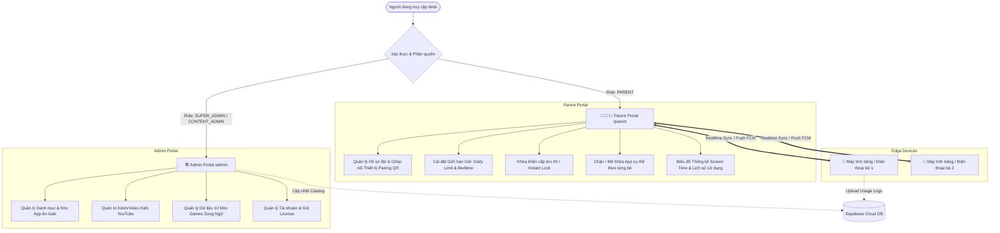
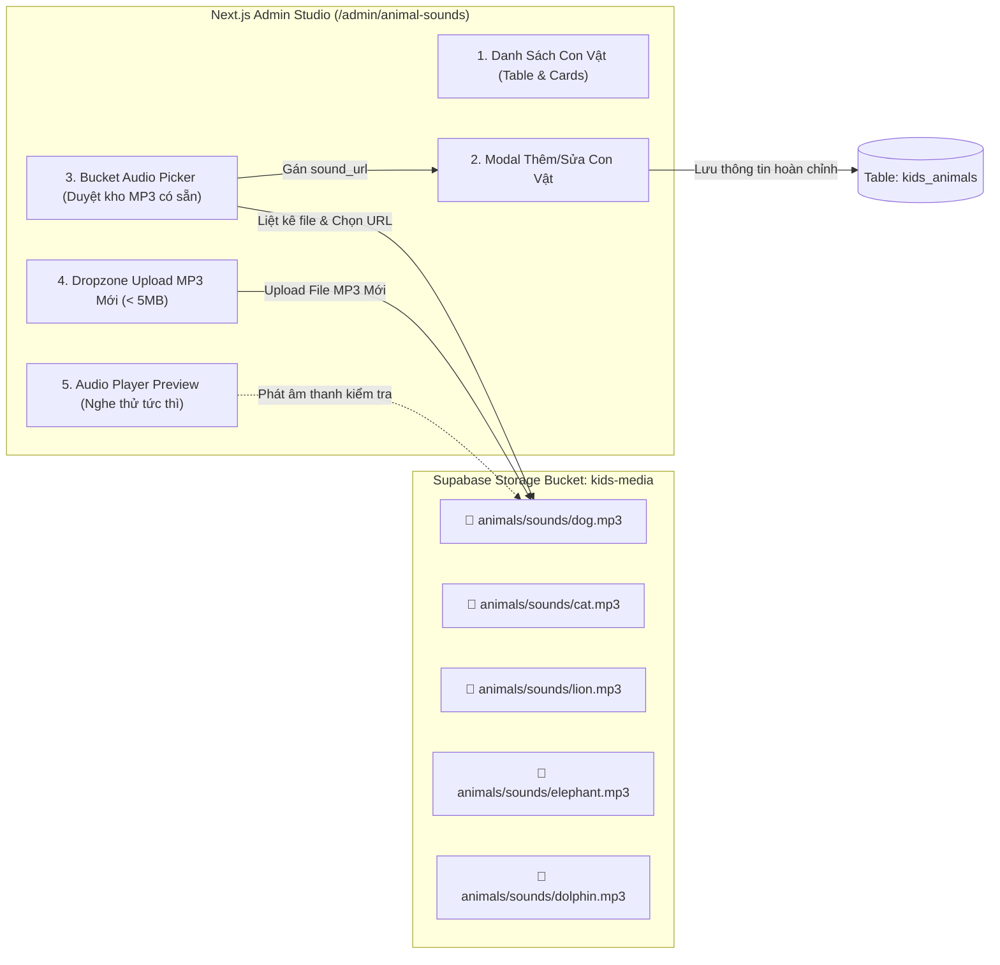
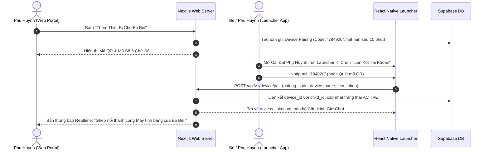
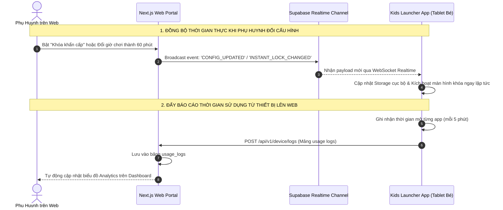

# 🌐 ĐẶC TẢ KIẾN TRÚC & HƯỚNG DẪN TRIỂN KHAI NEXT.JS WEB PORTAL
## Hệ Thống Quản Trị Trung Tâm (Super Admin) & Cổng Điều Khiển Dành Cho Phụ Huynh (Parent Portal)

> **Tài liệu đặc tả kỹ thuật, thiết kế cơ sở dữ liệu, phân quyền RBAC và giao tiếp Realtime giữa Next.js Web Portal với thiết bị Android Kids Launcher.**  
> *Phiên bản: 1.0.0*  
> *Tương thích hệ sinh thái: Next.js 14+ (App Router), Supabase (PostgreSQL 17, Auth, Realtime, RLS), React Native Launcher Kit.*

---

## 📑 MỤC LỤC

1. [Tổng Quan & Mục Tiêu Hệ Thống](#1-tổng-quan--mục-tiêu-hệ-thống)
2. [Kiến Trúc Kỹ Thuật Tổng Thể (System Architecture)](#2-kiến-trúc-kỹ-thuật-tổng-thể-system-architecture)
3. [Ma Trận Phân Quyền & Sơ Đồ Điều Hướng (RBAC & Route Map)](#3-ma-trận-phân-quyền--sơ-đồ-điều-hướng-rbac--route-map)
4. [Đặc Tả Chi Tiết Phân Hệ Super Admin (`/admin`)](#4-đặc-tả-chi-tiết-phân-hệ-super-admin-admin)
5. [Đặc Tả Chi Tiết Phân Hệ Phụ Huynh (`/parent`)](#5-đặc-tả-chi-tiết-phân-hệ-phụ-huynh-parent)
6. [Thiết Kế Cơ Sở Dữ Liệu & RLS Policies (Database Schema)](#6-thiết-kế-cơ-sở-dữ-liệu--rls-policies-database-schema)
7. [Giao Thức Giao Tiếp & Đồng Bộ Thời Gian Thực (Sync & Realtime Protocol)](#7-giao-thức-giao-tiếp--đồng-bộ-thời-gian-thực-sync--realtime-protocol)
8. [Cấu Trúc Thư Mục Chuẩn Next.js 14 (Project Structure)](#8-cấu-trúc-thư-mục-chuẩn-nextjs-14-project-structure)
9. [Lộ Trình Triển Khai Từng Bước (Implementation Roadmap)](#9-lộ-trình-triển-khai-từng-bước-implementation-roadmap)

---

## 🎯 1. TỔNG QUAN & MỤC TIÊU HỆ THỐNG

Hệ thống **Next.js Web Portal** là trung tâm điều khiển đám mây (Cloud Command Center) phục vụ 2 nhóm người dùng chính:



---

## 🏛️ 2. KIẾN TRÚC KỸ THUẬT TỔNG THỂ (SYSTEM ARCHITECTURE)

### 2.1. Tech Stack Được Lựa Chọn

| Thành Phần | Công Nghệ | Vai Trò & Lợi Điểm |
| :--- | :--- | :--- |
| **Framework** | **Next.js 14+ (App Router)** | Server Components (RSC), Server Actions, Route Handlers (API), tối ưu SEO và tốc độ tải trang. |
| **Giao Diện (UI)** | **TailwindCSS + Shadcn/ui** | Hệ thống Design System đồng nhất, hiện đại, hỗ trợ Dark/Light mode, component chuẩn Accessibility. |
| **Thư Viện Biểu Đồ** | **Recharts** hoặc **Tremor** | Vẽ biểu đồ thời gian sử dụng (Screen Time Bar Charts, Pie Charts, Heatmaps). |
| **Database & Auth** | **Supabase (PostgreSQL 17)** | Quản lý người dùng, Row Level Security (RLS) bảo vệ dữ liệu giữa các gia đình, Supabase Storage lưu trữ media. |
| **Realtime Engine** | **Supabase Realtime + FCM** | Kênh Realtime WebSocket truyền lệnh khóa máy; Firebase Cloud Messaging gửi silent push đánh thức thiết bị. |
| **Xử Lý Form & Validate** | **React Hook Form + Zod** | Validate dữ liệu nhập liệu từ phía Admin và các cấu hình giờ của Phụ huynh. |
| **Cổng Thanh Toán** | **PayOS (VietQR) / MoMo** | Tự động hóa mua và gia hạn gói Family Pro qua mã QR ngân hàng. |

---

## 🗂️ 3. MA TRẬN PHÂN QUYỀN & SƠ ĐỒ ĐIỀU HƯỚNG (RBAC & ROUTE MAP)

### 3.1. Phân Quyền 2 Vai Trò Cốt Lõi (2 Core Roles)

Hệ thống được thiết kế phân chia tách bạch thành **2 Đối tượng / Roles người dùng chính**:

1. 🛠️ **`ADMIN` (Quản trị viên Hệ thống)**:
   * Quản lý dữ liệu danh mục gốc (Master Data & App Catalog).
   * Kiểm duyệt kho video/kênh Kids YouTube an toàn.
   * Sử dụng công cụ sinh ngân hàng đề toán tự động và nội dung các Mini Games.
   * Quản lý danh sách tài khoản, gói cước và giám sát thiết bị toàn hệ thống.

2. 👨‍👩‍👧‍👦 **`CUSTOMER` (Khách hàng / Cha Mẹ của Trẻ)**:
   * Quản lý hồ sơ các bé trong gia đình và ghép nối thiết bị tablet/điện thoại qua mã QR / 6 số.
   * Cài đặt quy định thời gian: **Daily Screen Time Limit** & **Bedtime Schedule**.
   * Quản lý quyền mở/chặn từng ứng dụng riêng biệt trên máy bé.
   * Bật/Tắt tính năng **Khóa Khẩn Cấp Tức Thì (Instant Remote Lock)**.
   * Xem báo cáo và biểu đồ phân tích thời lượng sử dụng (**Screen Time Analytics**).

---

### 3.2. Sơ Đồ Điều Hướng 2 Dashboard Riêng Biệt (Dual Dashboard Route Map)

```text
/ (Landing Page giới thiệu hệ sinh thái Kids Launcher)
├── (auth)/
│   ├── login                    # Đăng nhập (Phân luồng theo Role: Admin -> /admin, Customer -> /customer)
│   ├── register                 # Đăng ký tài khoản Phụ huynh (Role mặc định: CUSTOMER)
│   ├── forgot-password          # Khôi phục mật khẩu
│   └── callback                 # Auth redirect callback
│
├── 🛠️ (admin)/admin/            # [DÀNH CHO ROLE: ADMIN]
│   ├── layout.tsx               # Admin Sidebar: Overview, Apps, YouTube, Games, Licenses
│   ├── dashboard                # 📊 DASHBOARD 1: Quản trị tổng quan (Users, Active Devices, System Stats)
│   ├── math-generator/          # 🧮 Math Generator Studio (Sinh 20/50/100 đề toán tự động vào Supabase)
│   ├── app-catalog/             # 📦 Quản lý kho App an toàn, gắn nhãn độ tuổi (3+, 6+, 12+)
│   └── youtube-curator/         # 📺 Kiểm duyệt kênh & video Kids YouTube Whitelist
│
├── 👨‍👩‍👧‍👦 (customer)/customer/      # [DÀNH CHO ROLE: CUSTOMER / PHỤ HUYNH] (Hỗ trợ alias /parent)
│   ├── layout.tsx               # Customer Navbar & Header thân thiện (Mobile & Desktop)
│   ├── dashboard                # 📊 DASHBOARD 2: Điều khiển thiết bị con, Nút Khóa Tức Thì, Trạng thái máy
│   ├── rules/                   # ⏳ Cài đặt Giờ chơi mỗi ngày (Slider), Giờ đi ngủ (Bedtime) & Bật/Tắt App
│   ├── analytics/               # 📈 Báo cáo Screen Time Recharts (Biểu đồ 7 ngày & Tỷ lệ Học/Chơi)
│   └── children/                # 👦 Hồ sơ bé & Trình tạo mã QR / 6 số Ghép nối thiết bị
│
└── ⚡ api/v1/device/             # REST Endpoints giao tiếp với Android Kids Launcher
    ├── pair/route.ts            # Nhận mã 6 số ghép nối từ máy bé
    ├── config/route.ts          # Trả về toàn bộ rules & danh sách app được phép
    └── logs/route.ts            # Nhận batch nhật ký thời gian dùng app từ máy bé
```

---

## 🛠️ 4. ĐẶC TẢ CHI TIẾT PHÂN HỆ SUPER ADMIN (`/admin`)

### 4.1. Quản Trị Kho Ứng Dụng (App Catalog Studio)
* **Chức năng**:
  * Nhập liệu tên gói Android Package Name (`com.google.android.youtube`, `org.khanacademy.android`, ...).
  * Gán thể loại: *Học tập (Education)*, *Giải trí (Entertainment)*, *Game tư duy*, *Mạng xã hội*, *App cấm tuyệt đối*.
  * Gắn nhãn độ tuổi an toàn (3+, 6+, 10+).
  * Upload icon ứng dụng hoặc lấy trực tiếp từ Google Play Store metadata.

### 4.2. Quản Trị Nội Dung YouTube An Toàn (YouTube Whitelist Curator)
* **Chức năng**:
  * Tìm kiếm kênh/video từ YouTube Data API v3 và bấm **"Duyệt An Toàn (Approve)"** vào hệ thống.
  * Phân loại video theo chủ đề: *Kể chuyện cổ tích*, *Học tiếng Anh*, *Khoa học vui*, *Âm nhạc thiếu nhi*.
  * Tùy chọn cấm phát video nếu có nội dung nhạy cảm hoặc từ khóa bị gắn cờ.

### 4.3. Quản Lý Hệ Thống Danh Mục Master Data (Category Management Studio)
* **Mục tiêu**: Cho phép Super Admin tạo, sửa, xóa các danh mục dùng chung cho toàn hệ thống mà không cần sửa code.
* **Các Nhóm Danh Mục**:
  1. 📱 **Danh mục Ứng dụng (App Categories)**: *Học tập (Education)*, *Giải trí an toàn (Entertainment)*, *Sáng tạo (Creative)*, *Mạng xã hội (Social - Mặc định cấm)*, *Tiện ích (Utility)*.
  2. 🦁 **Danh mục Thế giới Động vật (Animal Categories)**: *Gia súc & Vật nuôi (Pets & Farm)*, *Rừng rậm nhiệt đới (Jungle & Safari)*, *Đại dương & Thủy sinh (Ocean & Sea)*, *Loài chim (Birds)*, *Côn trùng (Insects)*.
  3. 📺 **Danh mục YouTube Kids (YouTube Categories)**: *Tiếng Anh mầm non*, *Cổ tích & Phép thuật*, *Khoa học kỳ thú*, *Ca nhạc thiếu nhi*, *Kỹ năng sống*.
  4. 🧮 **Chủ đề Toán học (Math Topics)**: *Đếm hình 1-10*, *Phép cộng trừ phạm vi 20*, *Bảng nhân 2-5*, *Bảng cửu chương 6-9 & Phép chia*.

---

### 4.4. Quản Lý Con Vật (Bảng `kids_animals`) & Chọn/Upload Âm Thanh MP3 Từ Bucket (`kids-media`)

#### A. Cấu Trúc Thông Tin Chi Tiết Bảng `public.kids_animals`
Bảng `kids_animals` đóng vai trò là kho dữ liệu trung tâm cho game **"Bé Khám Phá Thế Giới Động Vật" (Animal Sounds & Flashcards)**:

| Tên Cột (Column) | Kiểu Dữ Liệu | Ràng Buộc | Ý Nghĩa & Mục Đích Sử Dụng |
| :--- | :--- | :--- | :--- |
| `id` | `UUID` | `PRIMARY KEY DEFAULT gen_random_uuid()` | Định danh duy nhất của con vật |
| `animal_code` | `VARCHAR(50)` | `UNIQUE NOT NULL` | Mã định danh con vật (VD: `'dog'`, `'cat'`, `'lion'`, `'elephant'`, `'dolphin'`) |
| `name_vi` | `VARCHAR(100)` | `NOT NULL` | Tên tiếng Việt thân thiện (VD: *"Chú Chó Cưng"*, *"Mèo Con"*, *"Sư Tử Gầm"*) |
| `name_en` | `VARCHAR(100)` | `NOT NULL` | Tên tiếng Anh chuẩn (VD: *"Dog"*, *"Cat"*, *"Lion"*, *"Elephant"*) |
| `category` | `VARCHAR(100)` | `NOT NULL` | Phân loại danh mục (*Vật Nuôi & Gia Súc*, *Rừng Rậm*, *Đại Dương*, *Loài Chim*, *Côn Trùng*) |
| `icon_emoji` | `VARCHAR(10)` | `DEFAULT '🐾'` | Biểu tượng icon emoji hiển thị nhanh (VD: 🐶, 🐱, 🦁, 🐘, 🐬) |
| `image_url` | `TEXT` | `NOT NULL` | Đường dẫn ảnh minh họa hoạt hình sắc nét (Lưu tại `kids-media/animals/images/`) |
| `sound_url` | `TEXT` | `NOT NULL` | **URL file MP3 tiếng kêu thực tế của con vật** (Lưu tại `kids-media/animals/sounds/`) |
| `pronounce_vi_url` | `TEXT` | `NULL` | URL file MP3 giọng đọc chuẩn tiếng Việt (phát âm: *"Con Chó"*) |
| `pronounce_en_url` | `TEXT` | `NULL` | URL file MP3 giọng đọc bản ngữ tiếng Anh (phát âm: *"Dog"*) |
| `fun_fact_vi` | `TEXT` | `NULL` | Câu đố / kiến thức vui tiếng Việt (VD: *"Chó là người bạn trung thành nhất của con người!"*) |
| `fun_fact_en` | `TEXT` | `NULL` | Kiến thức vui tiếng Anh (VD: *"Dogs have a great sense of smell!"*) |
| `sort_order` | `INT` | `DEFAULT 0` | Thứ tự ưu tiên sắp xếp hiển thị trên Launcher của bé |
| `is_active` | `BOOLEAN` | `DEFAULT TRUE` | Trạng thái hiển thị (TRUE: Đang mở cho bé chơi, FALSE: Tạm ẩn) |
| `created_at` | `TIMESTAMPTZ` | `DEFAULT NOW()` | Thời điểm tạo bản ghi |
| `updated_at` | `TIMESTAMPTZ` | `DEFAULT NOW()` | Thời điểm cập nhật lần cuối |

---

#### B. Kiến Trúc Lưu Trữ & Trình Chọn File Âm Thanh Từ Bucket (Bucket Storage Browser)



* **2 Cách Chọn Âm Thanh Linh Hoạt Cho Admin**:
  1. **Cách 1: Chọn từ Kho File Sẵn Có Trong Bucket (`Bucket Audio Browser`)**:
     * Web Portal gọi `supabase.storage.from('kids-media').list('animals/sounds')` để lấy toàn bộ danh sách file âm thanh đã tải lên trước đó.
     * Admin có thể bấm nút **Play (▶)** để nghe thử từng file âm thanh trong kho.
     * Bấm **"Chọn File Này"** $\rightarrow$ Hệ thống tự động gán đường dẫn Public CDN URL vào trường `sound_url`.
  2. **Cách 2: Upload Trực Tiếp File MP3 Mới**:
     * Kéo thả file âm thanh từ máy tính $\rightarrow$ Upload lên Bucket $\rightarrow$ Tự động lấy Public URL điền vào trường dữ liệu.

---

### 4.5. Quản Trị Nội Dung 10 Mini Games Giáo Dục (EdTech CMS)
* **Dữ liệu Game Con Vật (Animal Sound)**: Upload file âm thanh MP3 tiếng kêu, phát âm tiếng Anh, tiếng Việt, hình ảnh minh họa vector.
* **Dữ liệu Game Toán Học (Math Quiz)**: Soạn bộ câu hỏi cộng trừ nhân chia theo lớp (Mầm non, Lớp 1, Lớp 2, Lớp 3).
* **Dữ liệu Game Đánh Vần (Word Spelling)**: Soạn danh sách từ vựng, chia tách ký tự chữ cái, file phát âm mẫu.
* **Dữ liệu Game Xếp Hình & Mê Cung (Tangram & Maze)**: Lưu trữ tọa độ SVG, đa giác và ma trận mê cung.

---

## 👨‍👩‍👧‍👦 5. ĐẶC TẢ CHI TIẾT PHÂN HỆ PHỤ HUYNH (`/parent`)

### 5.1. Quy Trình Ghép Nối Thiết Bị (Device Pairing Flow)



### 5.2. Trung Tâm Điều Khiển Thời Gian & Khóa Máy Từ Xa

1. **Khóa Khẩn Cấp (Instant Lock)**:
   * Nút bấm bật/tắt lớn màu đỏ. Khi bật, gửi lệnh realtime xuống tablet để khóa ngay tức khắc kèm lời nhắn: *"Đã đến giờ ăn cơm / nghỉ ngơi rồi con yêu!"*.
2. **Cài Đặt Giới Hạn Giờ Hàng Ngày (Daily Screen Time Limit)**:
   * Thanh trượt (Slider) chọn số phút được dùng máy trong ngày (VD: 60 phút, 90 phút, 120 phút).
   * Tùy chọn cài đặt riêng cho Ngày trong tuần (Thứ 2 - Thứ 6) và Cuối tuần (Thứ 7, CN).
3. **Giờ Giới Nghiêm Đi Ngủ (Bedtime Schedule)**:
   * Chọn khung giờ ngủ (VD: Từ `21:00` tối đến `06:30` sáng hôm sau).
   * Trong khung giờ này, ứng dụng tự động hiển thị màn hình khóa chúc bé ngủ ngon.

### 5.3. Quản Lý Danh Sách Ứng Dụng Được Phép (App Allowlist)
* Hiển thị danh sách các ứng dụng thực tế đang cài đặt trên máy của bé.
* Switch bật/tắt cho phép mở từng app.
* Đặt giới hạn thời gian cho từng app riêng lẻ (VD: Chỉ cho phép YouTube Kids tối đa 30 phút/ngày, còn Mini Games học tập không giới hạn).

### 5.4. Dashboard Thống Kê & Báo Cáo Thông Minh (Analytics & Reports)

```text
┌────────────────────────────────────────────────────────────────────────┐
│ 📊 BÁO CÁO SỬ DỤNG HÔM NAY - BÉ BIN (6 TUỔI)                           │
├───────────────────────────────────────┬────────────────────────────────┤
│ ⏳ Tổng thời gian sử dụng: 1h 15m / 2h │ 🔒 Trạng thái máy: Đang mở     │
├───────────────────────────────────────┴────────────────────────────────┤
│ [Biểu đồ Cột Recharts: Phân bố thời gian dùng theo từng khung giờ]     │
│ 08:00 ██                                                               │
│ 14:00 ██████ (Game Toán Học)                                           │
│ 19:00 ████ (YouTube Kids)                                              │
├────────────────────────────────────────────────────────────────────────┤
│ 🏆 TOP ỨNG DỤNG BÉ YÊU THÍCH:                                          │
│ 1. 🧮 Math Quiz Game       - 35 phút (Học tập)   ⭐ 15 bài toán đúng   │
│ 2. 📺 Kênh Vui Học Tiếng Anh - 25 phút (Giải trí)                      │
│ 3. 🎨 Coloring Paint Game   - 15 phút (Sáng tạo)                       │
│                                                                        │
│ ⚠️ CẢNH BÁO VI PHẠM:                                                  │
│ • Bé đã thử mở 'Cài đặt hệ thống' 2 lần lúc 15:30 (Đã bị chặn bởi PIN) │
└────────────────────────────────────────────────────────────────────────┘
```

---

## 🗄️ 6. THIẾT KẾ CƠ SỞ DỮ LIỆU & RLS POLICIES (DATABASE SCHEMA)

Toàn bộ hệ thống chạy trên **Supabase PostgreSQL 17** với chính sách bảo mật **Row Level Security (RLS)**:

```sql
-- 1. Bảng User Profiles & Phân quyền
CREATE TYPE user_role AS ENUM ('ADMIN', 'CUSTOMER');

CREATE TABLE public.user_profiles (
    id UUID PRIMARY KEY REFERENCES auth.users(id) ON DELETE CASCADE,
    email TEXT NOT NULL,
    full_name TEXT,
    phone_number TEXT,
    role user_role DEFAULT 'CUSTOMER', -- Mặc định: Phụ huynh của bé
    created_at TIMESTAMPTZ DEFAULT NOW(),
    updated_at TIMESTAMPTZ DEFAULT NOW()
);

-- 2. Bảng Hồ sơ Trẻ em (Children)
CREATE TABLE public.children (
    id UUID PRIMARY KEY DEFAULT gen_random_uuid(),
    parent_id UUID NOT NULL REFERENCES public.user_profiles(id) ON DELETE CASCADE,
    name TEXT NOT NULL,
    birth_date DATE,
    age INT,
    avatar_url TEXT,
    created_at TIMESTAMPTZ DEFAULT NOW()
);

-- 3. Bảng Thiết bị Trẻ em (Devices)
CREATE TABLE public.devices (
    id UUID PRIMARY KEY DEFAULT gen_random_uuid(),
    child_id UUID REFERENCES public.children(id) ON DELETE SET NULL,
    parent_id UUID NOT NULL REFERENCES public.user_profiles(id) ON DELETE CASCADE,
    device_name TEXT NOT NULL,
    device_model TEXT,
    fcm_token TEXT,
    is_locked_instant BOOLEAN DEFAULT FALSE,
    lock_message TEXT DEFAULT 'Đã đến giờ nghỉ ngơi rồi bé ơi!',
    battery_level INT,
    is_online BOOLEAN DEFAULT FALSE,
    last_active_at TIMESTAMPTZ DEFAULT NOW(),
    pairing_code VARCHAR(6),
    pairing_expires_at TIMESTAMPTZ,
    status TEXT DEFAULT 'ACTIVE' -- PENDING_PAIR | ACTIVE | INACTIVE
);

-- 4. Bảng Quy Định Thời Gian & Giới Hạn (Usage Rules)
CREATE TABLE public.usage_rules (
    id UUID PRIMARY KEY DEFAULT gen_random_uuid(),
    child_id UUID UNIQUE NOT NULL REFERENCES public.children(id) ON DELETE CASCADE,
    daily_limit_minutes_weekday INT DEFAULT 120, -- 2 tiếng ngày thường
    daily_limit_minutes_weekend INT DEFAULT 180, -- 3 tiếng cuối tuần
    bedtime_enabled BOOLEAN DEFAULT TRUE,
    bedtime_start TIME DEFAULT '21:00:00',
    bedtime_end TIME DEFAULT '06:30:00',
    blocked_packages TEXT[] DEFAULT ARRAY[]::TEXT[],
    app_specific_limits JSONB DEFAULT '{}'::JSONB, -- {"com.google.android.youtube": 30}
    updated_at TIMESTAMPTZ DEFAULT NOW()
);

-- 5. Bảng Nhật Ký Sử Dụng (Usage Logs)
CREATE TABLE public.usage_logs (
    id BIGSERIAL PRIMARY KEY,
    device_id UUID NOT NULL REFERENCES public.devices(id) ON DELETE CASCADE,
    child_id UUID NOT NULL REFERENCES public.children(id) ON DELETE CASCADE,
    package_name TEXT NOT NULL,
    app_name TEXT,
    duration_seconds INT NOT NULL DEFAULT 0,
    session_date DATE NOT NULL DEFAULT CURRENT_DATE,
    created_at TIMESTAMPTZ DEFAULT NOW()
);
CREATE INDEX idx_usage_logs_child_date ON public.usage_logs(child_id, session_date);

-- 6. Bảng Master Kho Ứng Dụng (Dành cho Admin)
CREATE TABLE public.app_catalog (
    id UUID PRIMARY KEY DEFAULT gen_random_uuid(),
    package_name TEXT UNIQUE NOT NULL,
    app_name TEXT NOT NULL,
    category TEXT NOT NULL, -- Education, Entertainment, Game, System, Blocked
    min_safe_age INT DEFAULT 3,
    icon_url TEXT,
    is_recommended BOOLEAN DEFAULT FALSE,
    description TEXT
);

-- 7. Bảng Thế Giới Động Vật & Âm Thanh MP3 (Dành cho Game Bé Học Tiếng Con Vật)
CREATE TABLE public.kids_animals (
    id UUID PRIMARY KEY DEFAULT gen_random_uuid(),
    animal_code VARCHAR(50) UNIQUE NOT NULL, -- 'dog', 'cat', 'lion', 'elephant', 'tiger'
    name_vi VARCHAR(100) NOT NULL,           -- 'Chú Chó Cưng', 'Mèo Con'
    name_en VARCHAR(100) NOT NULL,           -- 'Dog', 'Cat'
    category VARCHAR(100) NOT NULL,          -- 'Vật Nuôi & Gia Súc', 'Rừng Rậm', 'Đại Dương'
    icon_emoji VARCHAR(10) DEFAULT '🐾',
    image_url TEXT NOT NULL,                 -- Lưu trên Bucket kids-media/animals/images/
    sound_url TEXT NOT NULL,                 -- Lưu trên Bucket kids-media/animals/sounds/
    pronounce_vi_url TEXT,                   -- Lưu trên Bucket kids-media/animals/pronounce/
    pronounce_en_url TEXT,                   -- Lưu trên Bucket kids-media/animals/pronounce/
    fun_fact_vi TEXT,
    fun_fact_en TEXT,
    sort_order INT DEFAULT 0,
    is_active BOOLEAN DEFAULT TRUE,
    created_at TIMESTAMPTZ DEFAULT NOW(),
    updated_at TIMESTAMPTZ DEFAULT NOW()
);

-- BẬT ROW LEVEL SECURITY (RLS)
ALTER TABLE public.user_profiles ENABLE ROW LEVEL SECURITY;
ALTER TABLE public.children ENABLE ROW LEVEL SECURITY;
ALTER TABLE public.devices ENABLE ROW LEVEL SECURITY;
ALTER TABLE public.usage_rules ENABLE ROW LEVEL SECURITY;
ALTER TABLE public.usage_logs ENABLE ROW LEVEL SECURITY;
ALTER TABLE public.app_catalog ENABLE ROW LEVEL SECURITY;
ALTER TABLE public.kids_animals ENABLE ROW LEVEL SECURITY;

-- RLS: Phụ huynh chỉ xem và sửa dữ liệu của con mình
CREATE POLICY "Parents can view own children" 
    ON public.children FOR ALL 
    USING (parent_id = auth.uid());

CREATE POLICY "Parents can manage own devices" 
    ON public.devices FOR ALL 
    USING (parent_id = auth.uid());

CREATE POLICY "Parents can manage child rules" 
    ON public.usage_rules FOR ALL 
    USING (child_id IN (SELECT id FROM public.children WHERE parent_id = auth.uid()));

CREATE POLICY "Parents can view child usage logs" 
    ON public.usage_logs FOR SELECT 
    USING (child_id IN (SELECT id FROM public.children WHERE parent_id = auth.uid()));

-- RLS: Mọi người xem Catalog App, nhưng chỉ Admin mới được sửa
CREATE POLICY "Everyone can read app catalog" 
    ON public.app_catalog FOR SELECT 
    USING (TRUE);
```

---

## ⚡ 7. GIAO THỨC GIAO TIẾP & ĐỒNG BỘ THỜI GIAN THỰC (SYNC & REALTIME)



---

## 📁 8. CẤU TRÚC THƯ MỤC CHUẨN NEXT.JS 14 (PROJECT STRUCTURE)

```text
kids-launcher-portal/
├── .env.example
├── .env.local
├── package.json
├── tsconfig.json
├── tailwind.config.ts
├── src/
│   ├── app/
│   │   ├── (auth)/
│   │   │   ├── login/page.tsx
│   │   │   └── register/page.tsx
│   │   ├── (admin)/admin/
│   │   │   ├── layout.tsx                # Admin AppShell (Sidebar & Header)
│   │   │   ├── dashboard/page.tsx        # Overview Dashboard (Stats, Charts)
│   │   │   ├── app-catalog/page.tsx      # Quản lý kho App
│   │   │   ├── youtube/page.tsx          # Quản lý YouTube Whitelist
│   │   │   ├── games/page.tsx            # Quản lý dữ liệu 10 Mini Games
│   │   │   └── licenses/page.tsx         # Quản lý License Keys & Gói cước
│   │   ├── (parent)/parent/
│   │   │   ├── layout.tsx                # Parent AppShell
│   │   │   ├── dashboard/page.tsx        # Tổng quan các bé & nút Khóa Nhanh
│   │   │   ├── children/
│   │   │   │   ├── page.tsx              # Danh sách bé
│   │   │   │   ├── [childId]/rules/page.tsx # Cấu hình thời gian & app
│   │   │   │   └── [childId]/devices/page.tsx # Mã ghép nối thiết bị
│   │   │   ├── analytics/page.tsx        # Biểu đồ Screen Time chi tiết
│   │   │   └── billing/page.tsx          # Nâng cấp gói cước
│   │   ├── api/
│   │   │   ├── v1/device/pair/route.ts   # Ghép nối máy
│   │   │   ├── v1/device/config/route.ts # Kéo cấu hình
│   │   │   └── v1/device/logs/route.ts   # Nhận logs từ máy bé
│   │   └── layout.tsx
│   ├── components/
│   │   ├── ui/                           # Shadcn/ui buttons, cards, modals, sliders
│   │   ├── admin/                        # Component bảng biểu, dialog nhập liệu Admin
│   │   ├── parent/                       # Component biểu đồ, đồng hồ đếm giờ, card bé
│   │   └── shared/                       # Navbar, Header, Footer, QR Code Generator
│   ├── lib/
│   │   ├── supabase/
│   │   │   ├── client.ts                 # Supabase Browser Client
│   │   │   ├── server.ts                 # Supabase Server Component Client
│   │   │   └── admin.ts                  # Supabase Service Role Admin Client
│   │   ├── fcm.ts                        # Firebase Admin SDK gửi push notification
│   │   └── utils.ts                      # Hàm format thời gian, tính toán screen time
│   └── middleware.ts                     # Bảo vệ route, điều hướng theo Role (Admin/Parent)
```

---

## 🚀 9. LỘ TRÌNH TRIỂN KHAI TỪNG BƯỚC (IMPLEMENTATION ROADMAP)

### 🔹 Giai đoạn 1: Thiết Lập Dự Án & Cơ Sở Dữ Liệu
1. Khởi tạo dự án Next.js 14 với TypeScript, TailwindCSS, Lucide React, Shadcn/ui.
2. Thiết lập kết nối Supabase, chạy migration file SQL tạo bảng và cấu hình Auth & RLS.
3. Xây dựng Middleware phân quyền truy cập (`/admin` vs `/parent`).

### 🔹 Giai đoạn 2: Phát Triển Phân Hệ Super Admin (`/admin`)
1. Màn hình quản lý Danh mục ứng dụng an toàn (CRUD App Catalog).
2. Màn hình quản lý YouTube Kids Whitelist (Nhập link kênh/video, duyệt hiển thị).
3. Màn hình quản lý nội dung câu hỏi mini-game song ngữ và tải file MP3 lên Supabase Storage.

### 🔹 Giai đoạn 3: Phát Triển Phân Hệ Phụ Huynh (`/parent`)
1. Quản lý danh sách con và tạo mã ghép nối QR Code cho thiết bị.
2. Giao diện thiết lập Giới hạn thời gian chơi hàng ngày (Daily Limit) và Giờ đi ngủ (Bedtime).
3. Switch kiểm soát bật/tắt từng ứng dụng và nút gạt **"Khóa Khẩn Cấp"**.

### 🔹 Giai đoạn 4: Xây Dựng Dashboard Báo Cáo & Thống Kê (Analytics)
1. Tích hợp Recharts vẽ biểu đồ cột tổng giờ sử dụng theo từng ngày trong tuần.
2. Biểu đồ tròn phân loại thời gian: *Bé dành bao nhiêu % cho Học Toán, Tiếng Anh, Game, YouTube*.
3. Bảng danh sách cảnh báo vi phạm mở app cấm.

### 🔹 Giai đoạn 5: Tích Hợp Realtime & Kết Nối Với React Native Launcher
1. Viết Route Handlers `/api/v1/device/pair`, `/api/v1/device/logs`.
2. Tích hợp Supabase Realtime Channels để khi phụ huynh bấm nút trên Web, Tablet của bé nhận lệnh ngay tức thì.
3. Kiểm thử đồng bộ hai chiều giữa Web Portal và Ứng dụng Android Launcher.
