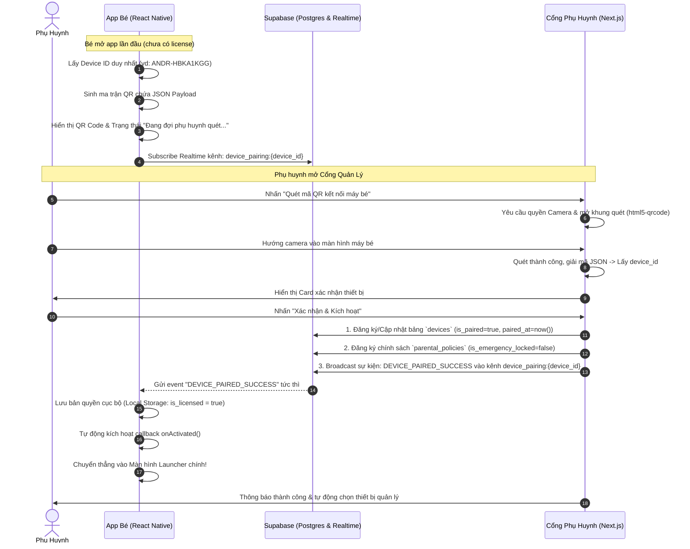

# Đặc Tả Kỹ Thuật: Hệ Thống Kích Hoạt & Ghép Nối Thiết Bị Qua Mã QR (QR Device Pairing & Activation)

- **Ngày tạo**: 2026-09-26
- **Trạng thái**: Đã phê duyệt (Approved)
- **Tác giả**: Antigravity Pair Programming

---

## 1. Tổng Quan & Mục Tiêu

Hệ thống cho phép phụ huynh ghép nối và kích hoạt máy tính bảng / điện thoại của bé (`rnlauncherkit`) với Cổng Quản Lý Phụ Huynh (`web-portal`) một cách hoàn toàn tự động thông qua quét mã QR trên màn hình.

### Mục tiêu chính:
1. **Không cần nhập mã thủ công**: Bé hoặc phụ huynh bật app bé lên lần đầu tiên sẽ thấy ngay mã QR sắc nét cùng mã định danh thiết bị (`device_id`).
2. **Quét bằng Camera từ Web Portal Phụ Huynh**: Phụ huynh sử dụng camera trên điện thoại hoặc laptop để quét mã QR từ máy bé trực tiếp trên trình duyệt web.
3. **Kích hoạt tự động thời gian thực (Zero-Touch Handshake)**: Ngay khi phụ huynh xác nhận ghép nối trên Web Portal, app máy bé lập tức nhận tín hiệu qua Supabase Realtime (< 0.5s) và tự động mở khóa vào Launcher chính.

---

## 2. Kiến Trúc & Luồng Hoạt Động (Sequence Diagram)



---

## 3. Cấu Trúc Dữ Liệu & Giao Thức (Data Contract)

### 3.1. Dữ liệu mã hóa trong QR Code (JSON Payload)
Chuỗi JSON được mã hóa vào mã QR có định dạng:
```json
{
  "action": "KIDS_LAUNCHER_PAIR",
  "v": 1,
  "device_id": "ANDR-HBKA1KGG",
  "device_name": "Galaxy Tab của Bé",
  "created_at": 1727356000000
}
```
- `action`: Định danh loại mã (`KIDS_LAUNCHER_PAIR`), ngăn ngừa quét nhầm các mã QR khác ngoài hệ thống.
- `v`: Phiên bản cấu trúc dữ liệu (`1`).
- `device_id`: Mã định danh duy nhất của máy bé trên hệ thống.
- `device_name`: Tên model máy bé để hiển thị trên portal phụ huynh.
- `created_at`: Dấu thời gian khởi tạo.

### 3.2. Sự kiện Supabase Realtime Broadcast
- **Channel**: `device_pairing:{device_id}`
- **Event**: `DEVICE_PAIRED_SUCCESS`
- **Payload**:
```json
{
  "device_id": "ANDR-HBKA1KGG",
  "parent_id": "parent_default",
  "license_key": "ACT-QR-SUCCESS",
  "timestamp": 1727356005000
}
```

### 3.3. Cập nhật Cơ sở Dữ liệu Supabase
1. **Bảng `devices`**:
   - `device_id`: Mã thiết bị (Primary / Unique key).
   - `device_name`: Tên thiết bị (vd: "Samsung Tab A9 của Bé").
   - `is_paired`: `true`.
   - `last_seen`: `now()`.
2. **Bảng `parental_policies`**:
   - `device_id`: Mã thiết bị.
   - `is_emergency_locked`: `false`.
   - `parent_pin`: `"1234"` (mặc định nếu chưa đổi).

---

## 4. Thiết Kế Chi Tiết Phía App Bé (`rnlauncherkit`)

### 4.1. Màn hình Kích hoạt: `LicenseActivationScreen.tsx`
- **Thành phần QR Code**:
  - Tích hợp module sinh ma trận QR thuần JavaScript (không cần phụ thuộc thư viện native C++/NDK), hiển thị các module pixel bằng React Native `<View>` vector sắc nét.
  - Kích thước hiển thị: 220x220dp, bo góc nhẹ, viền trắng nổi bật trên nền tối hoặc thẻ sáng.
- **Thành phần Trực quan**:
  - Huy hiệu xung nhịp (Pulsing badge) với biểu tượng quét sóng radar và dòng chữ: *"Đang đợi phụ huynh quét mã..."*
  - Khung hiển thị mã máy dạng chữ to rõ: **MÃ THIẾT BỊ: ANDR-HBKA1KGG** để nhập thủ công khi cần.
  - Nút bấm: *"Nhập mã kích hoạt thủ công"* (dự phòng).
- **Trình lắng nghe Realtime**:
  - Khi mount: Mở kết nối WebSocket Supabase kênh `device_pairing:${deviceId}`.
  - Khi nhận `DEVICE_PAIRED_SUCCESS`: Gọi `licenseService.activateLicense('ACT-QR-SUCCESS')` và kích hoạt `onActivated()`.
  - Có cơ chế polling dự phòng mỗi 3 giây kiểm tra bảng `devices` để đảm bảo nếu mạng rớt kết nối WebSocket thì vẫn kích hoạt được qua REST.

---

## 5. Thiết Kế Chi Tiết Phía Cổng Phụ Huynh (`web-portal`)

### 5.1. Modal Quét Mã QR: `QrScannerModal.tsx`
- Tích hợp thư viện `html5-qrcode` (hỗ trợ WebRTC Camera trên mọi trình duyệt iOS Safari, Android Chrome, MacOS/Windows).
- **Giao diện Modal**:
  - Khung ngắm laser quét QR với tia quét hoạt ảnh màu xanh neon.
  - Tự động chuyển đổi Camera (Camera trước / Camera sau).
  - Tự động tạm dừng khi quét trúng mã hợp lệ.
  - Âm thanh bíp xác nhận ngắn gọn khi bắt được mã.
- **Xác nhận Ghép nối**:
  - Hiển thị thông tin máy bé vừa quét được (Tên máy, Mã ID).
  - Nút *"Kích Hoạt & Liên Kết Thiết Bị"*: Gọi API `/api/v1/device/pair` và bắn Broadcast Realtime xuống máy bé.
  - Lưu `parent_active_device_id` vào `localStorage` của phụ huynh và chuyển hướng vào Dashboard quản lý của bé đó.

### 5.2. Điểm Kích Hoạt Trong Giao Diện Phụ Huynh:
1. **Trang Quản lý Hồ sơ Bé (`/parent/children`)**: Đặt nút nổi bật *"Quét mã QR máy bé"* ngay cạnh nút Thêm Bé.
2. **Trang Bảng Điều Khiển (`/parent/dashboard`)**: Trong Modal chuyển đổi thiết bị, bổ sung nút *"Quét QR thiết bị mới"*.

---

## 6. Xử Lý Các Trường Hợp Ngoại Lệ (Error Handling & Edge Cases)

1. **Mã QR không đúng định dạng**:
   - Nếu phụ huynh quét mã QR ngẫu nhiên khác: Hiển thị cảnh báo *"Mã QR không phải của Kids Launcher. Vui lòng quét mã trên màn hình của bé."*
2. **Trình duyệt không cấp quyền Camera**:
   - Hiển thị thông báo hướng dẫn phụ huynh bật quyền Camera trong cài đặt trình duyệt, kèm khung nhập mã ID 12 ký tự bằng tay.
3. **Mất kết nối mạng tạm thời trên máy bé**:
   - Nếu WebSocket bị ngắt, app bé tự động reconnect sau mỗi 2 giây và duy trì Polling REST API song song để không bao giờ bị sót sự kiện kích hoạt.
4. **Bé đã được kích hoạt từ trước nhưng phụ huynh quét lại**:
   - Hệ thống cho phép gán lại quyền quản lý cho phụ huynh mới mà không làm mất dữ liệu của bé.

---

## 7. Kế Hoạch Kiểm Thử (Verification Plan)

1. **Kiểm tra hiển thị QR trên App Bé**:
   - Khởi động app ở trạng thái chưa kích hoạt.
   - Xác nhận mã QR hiển thị rõ nét trên màn hình và quét được bởi ứng dụng quét mã thông thường.
2. **Kiểm tra Quét QR trên Cổng Phụ Huynh**:
   - Mở Cổng Phụ Huynh trên điện thoại/máy tính tại `http://localhost:3001/parent/children`.
   - Bấm "Quét mã QR máy bé", cấp quyền camera và quét màn hình giả lập LDPlayer.
   - Kiểm tra mã được đọc chính xác và gửi lên Supabase.
3. **Kiểm tra Tự Động Kích Hoạt Tức Thì (End-to-End Handshake)**:
   - Ngay khi bấm "Xác nhận", máy bé trên LDPlayer phải tự động biến mất màn hình chờ và mở thẳng màn hình Launcher chính trong vòng < 1 giây.
