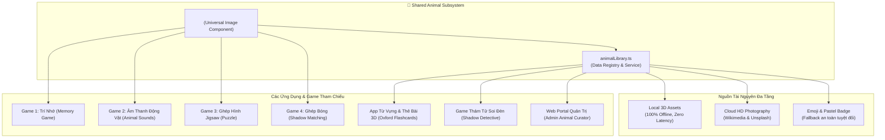

# Đặc Tả Kỹ Thuật: Thư Viện Động Vật Dùng Chung (Centralized Shared Animal Library)

- **Ngày tạo**: 2026-10-04
- **Trạng thái**: Đang chờ duyệt (Pending Approval)
- **Tác giả**: Antigravity Pair Programming
- **Phạm vi**: Toàn bộ hệ sinh thái Launcher Bé (Game Trí nhớ, Game Ghép hình, Game Âm thanh, Game Bóng, Học Từ vựng 3D, v.v.)

---

## 1. Bối Cảnh & Vấn Đề (Problem Statement)

Hiện nay, các màn hình game và ứng dụng học từ vựng trong ứng dụng Launcher đang quản lý dữ liệu động vật một cách rời rạc và phân mảnh:
- **Game Trí nhớ (`MemoryGameScreen.tsx`)**: Tự định nghĩa mảng emoji động vật (`🐶`, `🐱`, `🦁`, `🐼`...).
- **Game Ghép hình (`JigsawPuzzleGameScreen.tsx`)**: Tự định nghĩa puzzle con vật với các emoji riêng.
- **Game Bóng động vật (`ShadowMatchingGameScreen.tsx`)**: Tự định nghĩa danh sách con vật riêng biệt.
- **Game Âm thanh (`AnimalSoundGameScreen.tsx`)**: Quản lý danh sách âm thanh và ảnh Unsplash riêng.
- **Từ vựng Oxford 3D (`oxfordKidsVocabulary.ts` + `vocabImageService.ts`)**: Quản lý ảnh 3D local và link ảnh Wikimedia.

### Nhược điểm:
1. **Trải nghiệm thiếu đồng bộ**: Cùng là "Con sư tử", chỗ thì hiển thị emoji `🦁`, chỗ thì hiển thị ảnh Wikimedia, chỗ thì hiển thị ảnh 3D.
2. **Khó bảo trì và mở rộng**: Khi muốn nâng cấp hình ảnh của một con vật (ví dụ: thay ảnh 3D đẹp hơn), lập trình viên phải tìm và sửa ở 5-6 file khác nhau.
3. **Không tối ưu Offline**: Nhiều game chỉ dùng ảnh online, khi máy bé mất mạng Wi-Fi thì game bị trắng hình hoặc lỗi ảnh.

---

## 2. Kiến Trúc Giải Pháp: Hub Dữ Liệu Trung Tâm (`AnimalLibrary`)

Chúng ta xây dựng một hệ thống thư viện tập trung theo mô hình **Single Source of Truth**:



---

## 3. Cấu Trúc Dữ Liệu Chuẩn Hóa (`AnimalProfile`)

Mỗi con vật trong thư viện được định nghĩa đầy đủ thông tin đa phương tiện và sư phạm song ngữ:

```typescript
export type AnimalHabitat = 
  | 'farm'        // Nông trại & Gia súc gia cầm
  | 'safari'      // Thảo nguyên hoang dã
  | 'ocean'       // Đại dương sâu thẳm
  | 'forest'      // Rừng nhiệt đới & Núi cao
  | 'polar'       // Vùng cực băng giá
  | 'sky_birds'   // Bầu trời & Loài chim
  | 'insects';    // Côn trùng & Bò sát nhỏ

export interface AnimalImageSource {
  local3D?: any;        // require('../assets/images/...3d.jpg')
  photoHd: string;      // URL ảnh chụp studio thực tế độ phân giải cao
  thumbnail: string;    // URL ảnh thu nhỏ vuông tối ưu
  colorBg: string;      // Mã màu nền pastel hài hòa (vd: '#FEF3C7')
}

export interface AnimalSoundProfile {
  sfxUrl?: string;          // Âm thanh tiếng kêu thực tế (MP3)
  voiceViUrl?: string;      // Giọng đọc tiếng Việt
  voiceEnUrl?: string;      // Giọng đọc tiếng Anh
  soundTextVi: string;      // Phiên âm tiếng kêu: "Gâu gâu!", "Ò ó o o!"
  soundTextEn: string;      // Phiên âm tiếng Anh: "Woof woof!", "Cock-a-doodle-doo!"
}

export interface AnimalProfile {
  id: string;               // Khóa định danh duy nhất (vd: 'dog', 'lion', 'elephant')
  nameVi: string;           // Tên tiếng Việt: "Sư Tử"
  nameEn: string;           // Tên tiếng Anh: "Lion"
  phoneticEn: string;       // Phiên âm IPA: "/ˈlaɪ.ən/"
  emoji: string;            // Biểu tượng cảm xúc: '🦁'
  habitat: AnimalHabitat;   // Môi trường sống
  habitatNameVi: string;    // "Thảo Nguyên"
  habitatNameEn: string;    // "Savanna"
  
  image: AnimalImageSource; // Tài nguyên hình ảnh
  sound?: AnimalSoundProfile; // Âm thanh & Tiếng kêu

  funFactVi: string;        // Kiến thức thú vị cho bé bằng tiếng Việt
  funFactEn: string;        // Kiến thức thú vị bằng tiếng Anh
  exampleVi: string;        // Câu ví dụ tiếng Việt
  exampleEn: string;        // Câu ví dụ tiếng Anh
}
```

---

## 4. Danh Sách Các Con Vật Trong Thư Viện (38 Loài Động Vật Chuẩn Hóa)

Thư viện bao quát **7 nhóm sinh thái** với **38 loài động vật** thân thuộc và hấp dẫn nhất cho trẻ em:

### Nhóm 1: Nông Trại & Thú Cưng (Farm & Pets) - 8 loài
| ID | Tên Tiếng Việt | Tên Tiếng Anh | Emoji | Ảnh 3D Local | Tiếng kêu (Vi / En) |
|---|---|---|:---:|:---:|---|
| `dog` | Chú Cún Con | Puppy (Dog) | 🐶 | ✅ `dog_3d.jpg` | Gâu gâu! / Woof woof! |
| `cat` | Mèo Con | Kitten (Cat) | 🐱 | ✅ `cat_3d.jpg` | Meo meo! / Meow meow! |
| `cow` | Bò Sữa | Cow | 🐮 | Cloud HD | Ùm bòoo! / Moo mooo! |
| `pig` | Heo Con | Piglet (Pig) | 🐷 | Cloud HD | Ủn ỉn! / Oink oink! |
| `sheep` | Cừu Bông | Sheep | 🐑 | Cloud HD | Be beee! / Baa baaa! |
| `rooster`| Gà Trống | Rooster | 🐔 | Cloud HD | Ò ó o o! / Cock-a-doodle-doo! |
| `duck` | Vịt Con | Duckling | 🦆 | Cloud HD | Cạp cạp! / Quack quack! |
| `horse` | Chú Ngựa | Horse | 🐴 | Cloud HD | Hí hí! / Neigh neigh! |

### Nhóm 2: Thảo Nguyên Hoang Dã (Safari & Wild Jungle) - 8 loài
| ID | Tên Tiếng Việt | Tên Tiếng Anh | Emoji | Ảnh 3D Local | Tiếng kêu (Vi / En) |
|---|---|---|:---:|:---:|---|
| `lion` | Sư Tử Chúa | Lion | 🦁 | ✅ `lion_3d.jpg` | Gaooo! / Roaaar! |
| `elephant` | Voi Khổng Lồ | Elephant | 🐘 | ✅ `baby_elephant_3d.jpg` | Éc éc! / Pawoo! |
| `tiger` | Hổ Vằn | Tiger | 🐯 | Cloud HD | Gầm gừ! / Growl! |
| `giraffe` | Hươu Cao Cổ | Giraffe | 🦒 | Cloud HD | Thầm lặng / Gentle hum |
| `zebra` | Ngựa Vằn | Zebra | 🦓 | Cloud HD | Khịt khịt / Barking neigh |
| `monkey` | Khỉ Nhanh Nhẹn | Monkey | 🐒 | Cloud HD | Khẹc khẹc! / Ooh-aah! |
| `hippo` | Hà Mã | Hippo | 🦛 | Cloud HD | Ầm ầm / Grunt snort |
| `kangaroo`| Chuột Túi | Kangaroo | 🦘 | Cloud HD | Chitter / Thump thump |

### Nhóm 3: Đại Dương Sâu Thẳm (Ocean & Sea Life) - 6 loài
| ID | Tên Tiếng Việt | Tên Tiếng Anh | Emoji | Ảnh 3D Local | Tiếng kêu / Đặc điểm |
|---|---|---|:---:|:---:|---|
| `dolphin` | Cá Heo | Dolphin | 🐬 | Cloud HD | Chít chít! Sóng âm siêu thông minh |
| `whale` | Cá Voi Xanh | Blue Whale | 🐋 | Cloud HD | Hát dưới đáy biển sâu |
| `shark` | Cá Mập | Shark | 🦈 | Cloud HD | Bơi lội dũng mãnh |
| `turtle` | Rùa Biển | Sea Turtle | 🐢 | Cloud HD | Bơi thong thả ngàn dặm |
| `octopus` | Bạch Tuộc | Octopus | 🐙 | Cloud HD | 8 xúc tu biến ảo màu sắc |
| `fish` | Cá Hề | Clownfish | 🐠 | Cloud HD | Bơi tung tăng quanh rạn san hô |

### Nhóm 4: Rừng Rậm & Vùng Cao (Forest & Mountains) - 6 loài
| ID | Tên Tiếng Việt | Tên Tiếng Anh | Emoji | Ảnh 3D Local | Tiếng kêu (Vi / En) |
|---|---|---|:---:|:---:|---|
| `bear` | Gấu Nâu | Bear | 🐻 | Cloud HD | Gầm gừ / Growl roar |
| `panda` | Gấu Trúc | Panda | 🐼 | Cloud HD | Nhai trúc rộp rộp |
| `fox` | Cáo Đỏ | Red Fox | 🦊 | Cloud HD | Gâu ngắn / Yip bark |
| `wolf` | Chó Sói | Wolf | 🐺 | Cloud HD | Hú vang / Awoooo! |
| `deer` | Chú Hươu | Deer | 🦌 | Cloud HD | Chạy thoăn thoắt |
| `rabbit` | Thỏ Trắng | Rabbit | 🐰 | Cloud HD | Nhảy nhót vui tươi |

### Nhóm 5: Bầu Trời & Loài Chim (Sky & Birds) - 4 loài
| ID | Tên Tiếng Việt | Tên Tiếng Anh | Emoji | Ảnh 3D Local | Tiếng kêu (Vi / En) |
|---|---|---|:---:|:---:|---|
| `eagle` | Đại Bàng | Eagle | 🦅 | Cloud HD | Kêu réo rắt trên đỉnh núi cao |
| `owl` | Cú Mèo | Owl | 🦉 | Cloud HD | Cú cú! / Hoot hoot! |
| `penguin` | Chim Cánh Cụt | Penguin | 🐧 | Cloud HD | Lạch bạch trên băng |
| `parrot` | Vẹt Sặc Sỡ | Parrot | 🦜 | Cloud HD | Nhại tiếng người thông minh |

### Nhóm 6: Côn Trùng & Bò Sát Nhỏ (Insects & Mini Creatures) - 6 loài
| ID | Tên Tiếng Việt | Tên Tiếng Anh | Emoji | Ảnh 3D Local | Đặc điểm |
|---|---|---|:---:|:---:|---|
| `butterfly` | Bướm Xinh | Butterfly | 🦋 | ✅ `butterfly_3d.jpg` | Đôi cánh ngũ sắc rực rỡ |
| `caterpillar`| Sâu Bướm | Caterpillar | 🐛 | ✅ `caterpillar_3d.jpg` | Thích ăn lá non lớn nhanh |
| `chameleon` | Tắc Kè Hoa | Chameleon | 🦎 | ✅ `chameleon_3d.jpg` | Biến đổi màu sắc ngụy trang |
| `frog` | Chú Ếch Xanh | Green Frog | 🐸 | Cloud HD | Ộp ộp! / Ribbit ribbit! |
| `bee` | Ong Chăm Chỉ | Honey Bee | 🐝 | Cloud HD | Vo ve! / Buzz buzz! Làm mật ngọt |
| `crab` | Cua Càng | Crab | 🦀 | Cloud HD | Bò ngang ngộ nghĩnh |

---

## 5. Thiết Kế Component Tiện Ích: `<AnimalImage />`

Component được thiết kế tối ưu, có thể nhúng vào bất kỳ đâu chỉ với 1 dòng code:

```tsx
<AnimalImage 
  id="lion" 
  size={90} 
  rounded 
  showBadge 
  onPress={() => animalLibrary.playSound('lion')} 
/>
```

### Cơ chế Fallback 3 Tầng Thông Minh (Tiered Fallback Engine):
1. **Tầng 1 (Ưu tiên cao nhất)**: Nếu có `local3D` $\rightarrow$ Tải tức thì 0 mili-giây từ thư mục asset cục bộ.
2. **Tầng 2 (Khi không có ảnh 3D local)**: Tải ảnh chụp thực tế `photoHd` từ CDN (có hỗ trợ cache và hiệu ứng chuyển cảnh mượt).
3. **Tầng 3 (Khi mất mạng hoặc tải lỗi)**: Tự động chuyển về thẻ chứa Emoji to rõ kèm màu nền pastel chuyên dụng của con vật đó (`colorBg`), đảm bảo **100% không bao giờ bị trắng màn hình hay vỡ giao diện**.

---

## 6. Hướng Dẫn Tích Hợp Vào Các Game Hiện Có

1. **Game Trí Nhớ (`MemoryGameScreen.tsx`)**:
   - Thay vì dùng icon text đơn sơ, mỗi thẻ bài lật mở sẽ là `<AnimalImage id={item.id} size={50} />`.
2. **Game Ghép Hình (`JigsawPuzzleGameScreen.tsx`)**:
   - Các mảnh ghép sử dụng trực tiếp hình ảnh chuẩn từ `animalLibrary`.
3. **Game Âm Thanh Động Vật (`AnimalSoundGameScreen.tsx`)**:
   - Đồng bộ danh mục và âm thanh từ `animalLibrary`, tái sử dụng toàn bộ asset.
4. **Game Thám Tử Soi Đèn (`ShadowDetectiveScreen.tsx`) & Ghép Bóng (`ShadowMatchingGameScreen.tsx`)**:
   - Tạo bóng động vật tự động từ silhouette hoặc ảnh đại diện của `animalLibrary`.
5. **Flashcard Từ Vựng 3D (`oxfordKidsVocabulary.ts`)**:
   - Thẻ bài từ vựng học tiếng Anh lấy trực tiếp ảnh 3D và phiên âm IPA từ thư viện.

---

## 7. Kế Hoạch Triển Khai

1. **Giai đoạn 1**: Xây dựng module `example/src/libraries/animalLibrary.ts` chứa toàn bộ 38 con vật, các hàm truy vấn `getAnimal()`, `getByHabitat()`, `playSound()`.
2. **Giai đoạn 2**: Xây dựng component React Native `<AnimalImage />` với cơ chế fallback 3 tầng và test case Jest.
3. **Giai đoạn 3**: Refactor lần lượt các game (`MemoryGameScreen`, `AnimalSoundGameScreen`, `JigsawPuzzleGameScreen`...) chuyển sang dùng `animalLibrary`.
4. **Giai đoạn 4**: Kiểm thử thực tế trên giả lập Android LDPlayer.
